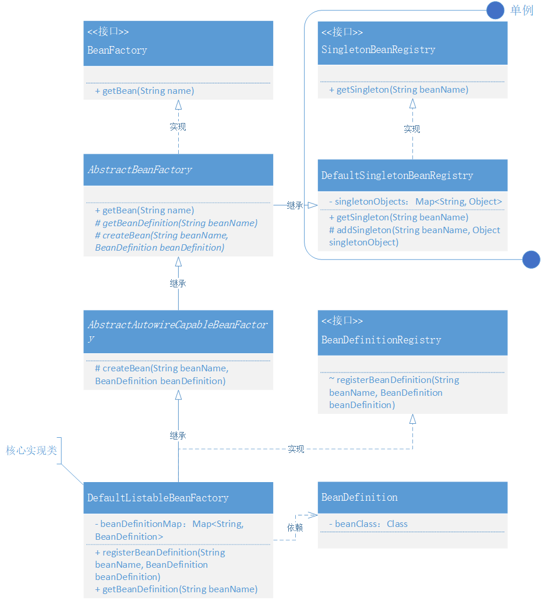

# Bean的定义注册获取

## 整体设计

## 类关系图


## 代码实现
### BeanDefinition定义
```java
public class BeanDefinition {

    private Class beanClass;

    public BeanDefinition(Class beanClass) {
        this.beanClass = beanClass;
    }
		// ...get/set
}
```

### 单例注册接口定义和实现
```java
public interface SingletonBeanRegistry {

    Object getSingleton(String beanName);

}
```

```java
public class DefaultSingletonBeanRegistry implements SingletonBeanRegistry {

    private Map<String, Object> singletonObjects = new HashMap<>();

    @Override
    public Object getSingleton(String beanName) {
        return singletonObjects.get(beanName);
    }

    protected void addSingleton(String beanName, Object singletonObject) {
        singletonObjects.put(beanName, singletonObject);
    }

}
```

### 抽象类定义模板方法(AbstractBeanFactory)
```java
public abstract class AbstractBeanFactory extends DefaultSingletonBeanRegistry implements BeanFactory {

    @Override
    public Object getBean(String name) throws BeansException {
        Object bean = getSingleton(name);
        if (bean != null) {
            return bean;
        }

        BeanDefinition beanDefinition = getBeanDefinition(name);
        return createBean(name, beanDefinition);
    }

    protected abstract BeanDefinition getBeanDefinition(String beanName) throws BeansException;

    protected abstract Object createBean(String beanName, BeanDefinition beanDefinition) throws BeansException;

}
```

### 实例化Bean类
```java
public abstract class AbstractAutowireCapableBeanFactory extends AbstractBeanFactory {

    @Override
    protected Object createBean(String beanName, BeanDefinition beanDefinition) throws BeansException {
        Object bean = null;
        try {
            bean = beanDefinition.getBeanClass().newInstance();
        } catch (InstantiationException | IllegalAccessException e) {
            throw new BeansException("Instantiation of bean failed", e);
        }

        addSingleton(beanName, bean);
        return bean;
    }

}
```

### 核心类实现(DefaultListableBeanFactory)
```java
public class DefaultListableBeanFactory extends AbstractAutowireCapableBeanFactory implements BeanDefinitionRegistry {

    private Map<String, BeanDefinition> beanDefinitionMap = new HashMap<>();

    @Override
    public void registerBeanDefinition(String beanName, BeanDefinition beanDefinition) {
        beanDefinitionMap.put(beanName, beanDefinition);
    }

    @Override
    public BeanDefinition getBeanDefinition(String beanName) throws BeansException {
        BeanDefinition beanDefinition = beanDefinitionMap.get(beanName);
        if (beanDefinition == null) throw new BeansException("No bean named '" + beanName + "' is defined");
        return beanDefinition;
    }

}
```

## 测试代码
### 测试准备
```java
public class UserService {

    public void queryUserInfo(){
        System.out.println("查询用户信息");
    }

}
```

### 测试用例
```java
@Test
public void test_BeanFactory(){
    // 1.初始化 BeanFactory
    DefaultListableBeanFactory beanFactory = new DefaultListableBeanFactory();
    // 2.注册 bean
    BeanDefinition beanDefinition = new BeanDefinition(UserService.class);
    beanFactory.registerBeanDefinition("userService", beanDefinition);
    // 3.第一次获取 bean
    UserService userService = (UserService) beanFactory.getBean("userService");
    userService.queryUserInfo();
    // 4.第二次获取 bean from Singleton
    UserService userService_singleton = (UserService) beanFactory.getBean("userService");
    userService_singleton.queryUserInfo();
}
```