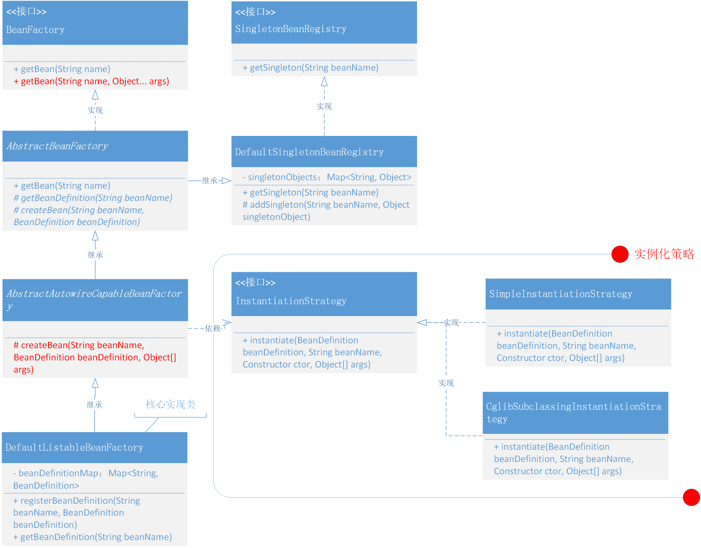

# Bean的定义注册获取

在上一节扩充了 Bean 容器的功能，把实例化对象交给容器来统一处理

但在实例化对象的代码里并没有考虑对象类是否含构造函数，如果去实例化一个含有构造函数的对象那么就要抛异常了

## 整体设计
- 参考 Spring Bean 容器源码的实现方式，在 BeanFactory 中添加 Object getBean(String name, Object... args) 接口，这样就可以在获取 Bean 时把构造函数的入参信息传递进去了。
- 另外一个核心的内容是使用什么方式来创建含有构造函数的 Bean 对象呢？
  - 一个是基于 Java 本身自带的方法 DeclaredConstructor 
  - 一个是使用 Cglib 来动态创建 Bean 对象。Cglib 是基于字节码框架 ASM 实现，所以也可以直接通过 ASM 操作指令码来创建对象

## 类关系图


## 代码实现
### 新增 getBean 接口
```java
public interface BeanFactory {

    Object getBean(String name) throws BeansException;

    Object getBean(String name, Object... args) throws BeansException;

}
```

### 定义实例化策略接口
```java
public interface InstantiationStrategy {

    Object instantiate(BeanDefinition beanDefinition, String beanName, Constructor ctor, Object[] args) throws BeansException;

}
```
- Constructor 是 java.lang.reflect 包下的 Constructor 类，里面包含了一些必要的类信息，有这个参数的目的就是为了拿到符合入参信息相对应的构造函数。
- args 就是一个具体的入参信息了，最终实例化时候会用到

### JDK 实例化
```java
public class SimpleInstantiationStrategy implements InstantiationStrategy {

    @Override
    public Object instantiate(BeanDefinition beanDefinition, String beanName, Constructor ctor, Object[] args) throws BeansException {
        Class clazz = beanDefinition.getBeanClass();
        try {
            if (null != ctor) {
                return clazz.getDeclaredConstructor(ctor.getParameterTypes()).newInstance(args);
            } else {
                return clazz.getDeclaredConstructor().newInstance();
            }
        } catch (NoSuchMethodException | InstantiationException | IllegalAccessException | InvocationTargetException e) {
            throw new BeansException("Failed to instantiate [" + clazz.getName() + "]", e);
        }
    }

}
```

### Cglib 实例化
```java
public class CglibSubclassingInstantiationStrategy implements InstantiationStrategy {

    @Override
    public Object instantiate(BeanDefinition beanDefinition, String beanName, Constructor ctor, Object[] args) throws BeansException {
        Enhancer enhancer = new Enhancer();
        enhancer.setSuperclass(beanDefinition.getBeanClass());
        enhancer.setCallback(new NoOp() {
            @Override
            public int hashCode() {
                return super.hashCode();
            }
        });
        if (null == ctor) return enhancer.create();
        return enhancer.create(ctor.getParameterTypes(), args);
    }

}
```

### 创建策略调用
```java
public abstract class AbstractAutowireCapableBeanFactory extends AbstractBeanFactory {

    private InstantiationStrategy instantiationStrategy = new CglibSubclassingInstantiationStrategy();

    @Override
    protected Object createBean(String beanName, BeanDefinition beanDefinition, Object[] args) throws BeansException {
        Object bean = null;
        try {
            bean = createBeanInstance(beanDefinition, beanName, args);
        } catch (Exception e) {
            throw new BeansException("Instantiation of bean failed", e);
        }

        addSingleton(beanName, bean);
        return bean;
    }

    protected Object createBeanInstance(BeanDefinition beanDefinition, String beanName, Object[] args) {
        Constructor constructorToUse = null;
        Class<?> beanClass = beanDefinition.getBeanClass();
        Constructor<?>[] declaredConstructors = beanClass.getDeclaredConstructors();
        for (Constructor ctor : declaredConstructors) {
            if (null != args && ctor.getParameterTypes().length == args.length) {
                constructorToUse = ctor;
                break;
            }
        }
        return getInstantiationStrategy().instantiate(beanDefinition, beanName, constructorToUse, args);
    }

}
```

## 测试代码
### 测试准备
```java
public class UserService {

    private String name;

    public UserService(String name) {
        this.name = name;
    }

    public void queryUserInfo() {
        System.out.println("查询用户信息：" + name);
    }

    @Override
    public String toString() {
        final StringBuilder sb = new StringBuilder("");
        sb.append("").append(name);
        return sb.toString();
    }
}
```

### 测试用例
```java
@Test
public void test_BeanFactory() {
    // 1.初始化 BeanFactory
    DefaultListableBeanFactory beanFactory = new DefaultListableBeanFactory();

    // 2. 注入bean
    BeanDefinition beanDefinition = new BeanDefinition(UserService.class);
    beanFactory.registerBeanDefinition("userService", beanDefinition);

    // 3.获取bean
    UserService userService = (UserService) beanFactory.getBean("userService", "李四");
    userService.queryUserInfo();
}
```
#### 无构造函数
```java
@Test
public void test_newInstance() throws IllegalAccessException, InstantiationException {
    UserService userService = UserService.class.newInstance();
    System.out.println(userService);
}
```

#### 验证有构造函数实例化
```java
@Test
public void test_constructor() throws Exception {
    Class<UserService> userServiceClass = UserService.class;
    Constructor<UserService> declaredConstructor = userServiceClass.getDeclaredConstructor(String.class);
    UserService userService = declaredConstructor.newInstance("李四");
    System.out.println(userService);
}
```

#### 获取构造函数信息
```java
@Test
public void test_parameterTypes() throws Exception {
    Class<UserService> beanClass = UserService.class;
    Constructor<?>[] declaredConstructors = beanClass.getDeclaredConstructors();
    Constructor<?> constructor = declaredConstructors[0];
    Constructor<UserService> declaredConstructor = beanClass.getDeclaredConstructor(constructor.getParameterTypes());
    UserService userService = declaredConstructor.newInstance("李四");
    System.out.println(userService);
```

#### Cglib 实例化
```java
@Test
public void test_cglib() {
    Enhancer enhancer = new Enhancer();
    enhancer.setSuperclass(UserService.class);
    enhancer.setCallback(new NoOp() {
        @Override
        public int hashCode() {
            return super.hashCode();
        }
    });
    Object obj = enhancer.create(new Class[]{String.class}, new Object[]{"李四"});
    System.out.println(obj);
}
```