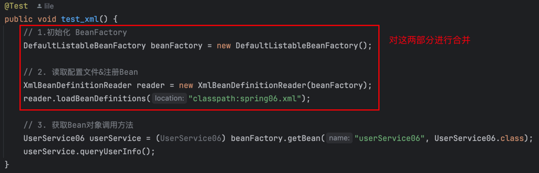
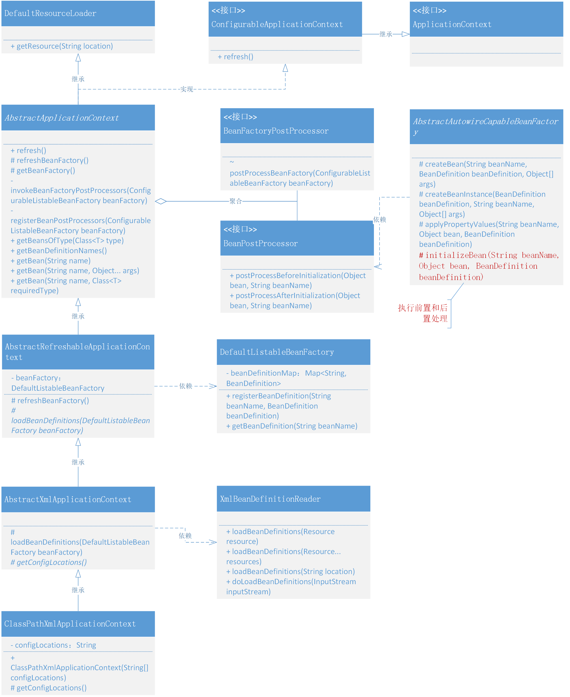

# 实现应用上下文，自动识别、资源加载、扩展机制
上一节还存在一个问题，实际开发时不太可能让面向 Spring 本身开发的 DefaultListableBeanFactory 服务，直接给予用户使用

- DefaultListableBeanFactory、XmlBeanDefinitionReader，是我们在目前 Spring 框架中对于服务功能测试的使用方式，它能很好的体现出 Spring 是如何对 xml 加载以及注册Bean对象的操作过程，但这种方式是面向 Spring 本身的，还不具备一定的扩展性。
- 就像我们现在需要提供出一个可以在 Bean 初始化过程中，完成对 Bean 对象的扩展时，就很难做到自动化处理。所以我们要把 Bean 对象扩展机制功能和对 Spring 框架上下文的包装融合起来，对外提供完整的服务。

## 整体设计
为了能满足于在 Bean 对象从注册到实例化的过程中执行用户的自定义操作，就需要在 Bean 的定义和初始化过程中插入接口类，这个接口由外部去实现自己需要的服务。

- BeanFactoryPostProcessor，是由 Spring 框架组建提供的容器扩展机制，允许在 Bean 对象注册后但未实例化之前，对 Bean 的定义信息 BeanDefinition 执行修改操作。
- BeanPostProcessor，也是 Spring 提供的扩展机制，不过 BeanPostProcessor 是在 Bean 对象实例化之后修改 Bean 对象，也可以替换 Bean 对象。这部分与后面要实现的 AOP 有着密切的关系。
- 开发 Spring 的上下文操作类，把相应的 XML 加载 、注册、实例化以及新增的修改和扩展都融合进去，让 Spring 可以自动扫描到我们的新增服务，便于用户使用。

## 类关系图
Spring 应用上下文和对Bean对象扩展机制的类关系


## 代码实现
### 定义 BeanFactoryPostProcessor
```java
public interface BeanFactoryPostProcessor {

    /**
     * 在所有的 BeanDefinition 加载完成后，实例化 Bean 对象之前，提供修改 BeanDefinition 属性的机制
     *
     * @param beanFactory
     * @throws BeansException
     */
    void postProcessBeanFactory(ConfigurableListableBeanFactory beanFactory) throws BeansException;

}
```

### 定义 BeanPostProcessor
```java
public interface BeanPostProcessor {

    /**
     * 在 Bean 对象执行初始化方法之前，执行此方法
     *
     * @param bean
     * @param beanName
     * @return
     * @throws BeansException
     */
    Object postProcessBeforeInitialization(Object bean, String beanName) throws BeansException;

    /**
     * 在 Bean 对象执行初始化方法之后，执行此方法
     *
     * @param bean
     * @param beanName
     * @return
     * @throws BeansException
     */
    Object postProcessAfterInitialization(Object bean, String beanName) throws BeansException;

}
```

### 定义上下文接口
```java
public interface ApplicationContext extends ListableBeanFactory {
}
```
```java
public interface ConfigurableApplicationContext extends ApplicationContext {

    /**
     * 刷新容器
     *
     * @throws BeansException
     */
    void refresh() throws BeansException;

}
```

### 应用上下文抽象类实现
```java
public abstract class AbstractApplicationContext extends DefaultResourceLoader implements ConfigurableApplicationContext {

    @Override
    public void refresh() throws BeansException {
        // 1. 创建 BeanFactory，并加载 BeanDefinition
        refreshBeanFactory();

        // 2. 获取 BeanFactory
        ConfigurableListableBeanFactory beanFactory = getBeanFactory();

        // 3. 在 Bean 实例化之前，执行 BeanFactoryPostProcessor (Invoke factory processors registered as beans in the context.)
        invokeBeanFactoryPostProcessors(beanFactory);

        // 4. BeanPostProcessor 需要提前于其他 Bean 对象实例化之前执行注册操作
        registerBeanPostProcessors(beanFactory);

        // 5. 提前实例化单例Bean对象
        beanFactory.preInstantiateSingletons();
    }

    protected abstract void refreshBeanFactory() throws BeansException;

    protected abstract ConfigurableListableBeanFactory getBeanFactory();

    private void invokeBeanFactoryPostProcessors(ConfigurableListableBeanFactory beanFactory) {
        Map<String, BeanFactoryPostProcessor> beanFactoryPostProcessorMap = beanFactory.getBeansOfType(BeanFactoryPostProcessor.class);
        for (BeanFactoryPostProcessor beanFactoryPostProcessor : beanFactoryPostProcessorMap.values()) {
            beanFactoryPostProcessor.postProcessBeanFactory(beanFactory);
        }
    }

    private void registerBeanPostProcessors(ConfigurableListableBeanFactory beanFactory) {
        Map<String, BeanPostProcessor> beanPostProcessorMap = beanFactory.getBeansOfType(BeanPostProcessor.class);
        for (BeanPostProcessor beanPostProcessor : beanPostProcessorMap.values()) {
            beanFactory.addBeanPostProcessor(beanPostProcessor);
        }
    }
    
    //... getBean、getBeansOfType、getBeanDefinitionNames 方法

}
```
- AbstractApplicationContext 继承 DefaultResourceLoader 是为了处理 spring.xml 配置资源的加载
- 另外把定义出来的抽象方法，refreshBeanFactory()、getBeanFactory() 由后面的继承此抽象类的其他抽象类实现

### 获取Bean工厂和加载资源
```java
public abstract class AbstractRefreshableApplicationContext extends AbstractApplicationContext {

    private DefaultListableBeanFactory beanFactory;

    @Override
    protected void refreshBeanFactory() throws BeansException {
        DefaultListableBeanFactory beanFactory = createBeanFactory();
        loadBeanDefinitions(beanFactory);
        this.beanFactory = beanFactory;
    }

    private DefaultListableBeanFactory createBeanFactory() {
        return new DefaultListableBeanFactory();
    }

    protected abstract void loadBeanDefinitions(DefaultListableBeanFactory beanFactory);

    @Override
    protected ConfigurableListableBeanFactory getBeanFactory() {
        return beanFactory;
    }

}
```
- 在 refreshBeanFactory() 中主要是获取了 DefaultListableBeanFactory 的实例化以及对资源配置的加载操作 loadBeanDefinitions(beanFactory)，在加载完成后即可完成对 spring.xml 配置文件中 Bean 对象的定义和注册，同时也包括实现了接口 BeanFactoryPostProcessor、BeanPostProcessor 的配置 Bean 信息。
- 但此时资源加载还只是定义了一个抽象类方法 loadBeanDefinitions(DefaultListableBeanFactory beanFactory)，继续由其他抽象类继承实现。

### 上下文中对配置信息的加载
```java
public abstract class AbstractXmlApplicationContext extends AbstractRefreshableApplicationContext {

    @Override
    protected void loadBeanDefinitions(DefaultListableBeanFactory beanFactory) {
        XmlBeanDefinitionReader beanDefinitionReader = new XmlBeanDefinitionReader(beanFactory, this);
        String[] configLocations = getConfigLocations();
        if (null != configLocations){
            beanDefinitionReader.loadBeanDefinitions(configLocations);
        }
    }

    protected abstract String[] getConfigLocations();

}
```
- 在 AbstractXmlApplicationContext 抽象类的 loadBeanDefinitions 方法实现中，使用 XmlBeanDefinitionReader 类，处理了关于 XML 文件配置信息的操作。
- 同时这里又留下了一个抽象类方法，getConfigLocations()，此方法是为了从入口上下文类，拿到配置信息的地址描述

### 应用上下文实现类
```java
public class ClassPathXmlApplicationContext extends AbstractXmlApplicationContext {

    private String[] configLocations;

    public ClassPathXmlApplicationContext() {
    }

    /**
     * 从 XML 中加载 BeanDefinition，并刷新上下文
     *
     * @param configLocations
     * @throws BeansException
     */
    public ClassPathXmlApplicationContext(String configLocations) throws BeansException {
        this(new String[]{configLocations});
    }

    /**
     * 从 XML 中加载 BeanDefinition，并刷新上下文
     * @param configLocations
     * @throws BeansException
     */
    public ClassPathXmlApplicationContext(String[] configLocations) throws BeansException {
        this.configLocations = configLocations;
        refresh();
    }

    @Override
    protected String[] getConfigLocations() {
        return configLocations;
    }

}
```
- ClassPathXmlApplicationContext，是具体对外给用户提供的应用上下文方法

### 在Bean创建时完成前置和后置处理
```java
public abstract class AbstractAutowireCapableBeanFactory extends AbstractBeanFactory implements AutowireCapableBeanFactory {

    private InstantiationStrategy instantiationStrategy = new CglibSubclassingInstantiationStrategy();

    @Override
    protected Object createBean(String beanName, BeanDefinition beanDefinition, Object[] args) throws BeansException {
        Object bean = null;
        try {
            bean = createBeanInstance(beanDefinition, beanName, args);
            // 给 Bean 填充属性
            applyPropertyValues(beanName, bean, beanDefinition);
            // 执行 Bean 的初始化方法和 BeanPostProcessor 的前置和后置处理方法
            bean = initializeBean(beanName, bean, beanDefinition);
        } catch (Exception e) {
            throw new BeansException("Instantiation of bean failed", e);
        }

        addSingleton(beanName, bean);
        return bean;
    }

    public InstantiationStrategy getInstantiationStrategy() {
        return instantiationStrategy;
    }

    public void setInstantiationStrategy(InstantiationStrategy instantiationStrategy) {
        this.instantiationStrategy = instantiationStrategy;
    }

    private Object initializeBean(String beanName, Object bean, BeanDefinition beanDefinition) {
        // 1. 执行 BeanPostProcessor Before 处理
        Object wrappedBean = applyBeanPostProcessorsBeforeInitialization(bean, beanName);

        // 待完成内容：invokeInitMethods(beanName, wrappedBean, beanDefinition);
        invokeInitMethods(beanName, wrappedBean, beanDefinition);

        // 2. 执行 BeanPostProcessor After 处理
        wrappedBean = applyBeanPostProcessorsAfterInitialization(bean, beanName);
        return wrappedBean;
    }

    private void invokeInitMethods(String beanName, Object wrappedBean, BeanDefinition beanDefinition) {

    }

    @Override
    public Object applyBeanPostProcessorsBeforeInitialization(Object existingBean, String beanName) throws BeansException {
        Object result = existingBean;
        for (BeanPostProcessor processor : getBeanPostProcessors()) {
            Object current = processor.postProcessBeforeInitialization(result, beanName);
            if (null == current) return result;
            result = current;
        }
        return result;
    }

    @Override
    public Object applyBeanPostProcessorsAfterInitialization(Object existingBean, String beanName) throws BeansException {
        Object result = existingBean;
        for (BeanPostProcessor processor : getBeanPostProcessors()) {
            Object current = processor.postProcessAfterInitialization(result, beanName);
            if (null == current) return result;
            result = current;
        }
        return result;
    }

}
```

- 实现 BeanPostProcessor 接口后，会涉及到两个接口方法，postProcessBeforeInitialization、postProcessAfterInitialization，分别作用于 Bean 对象执行初始化前后的额外处理。
- 也就是需要在创建 Bean 对象时，在 createBean 方法中添加 initializeBean(beanName, bean, beanDefinition); 操作。而这个操作主要主要是对于方法 applyBeanPostProcessorsBeforeInitialization、applyBeanPostProcessorsAfterInitialization 的使用。
- applyBeanPostProcessorsBeforeInitialization、applyBeanPostProcessorsAfterInitialization 两个方法是在接口类 AutowireCapableBeanFactory 中新增加的。

## 测试代码
### 测试准备
```java
public class UserDao {
    private static Map<String, String> hashMap = new HashMap<>();

    static {
        hashMap.put("10001", "李四");
        hashMap.put("10002", "张三");
        hashMap.put("10003", "王五");
    }

    public String queryUserName(String uId) {
        return hashMap.get(uId);
    }
}
```
```java
public class UserService07 {

    private String uId;
    private String company;
    private String location;
    private UserDao userDao;

    public String queryUserInfo() {
        return userDao.queryUserName(uId)+", 公司："+company+", 地点"+location;
    }

    // ...get/set
}
```
- Dao、Service，是我们平常开发经常使用的场景。在 UserService 中注入 UserDao，这样就能体现出Bean属性的依赖了。
- 另外这里新增加了 company、location，两个属性信息，便于测试 BeanPostProcessor、BeanFactoryPostProcessor 两个接口对 Bean 属性信息扩展的作用。

### 实现 BeanPostProcessor 和 BeanFactoryPostProcessor
```java
public class MyBeanFactoryPostProcessor implements BeanFactoryPostProcessor {

    @Override
    public void postProcessBeanFactory(ConfigurableListableBeanFactory beanFactory) throws BeansException {

        BeanDefinition beanDefinition = beanFactory.getBeanDefinition("userService07");
        PropertyValues propertyValues = beanDefinition.getPropertyValues();

        propertyValues.addPropertyValue(new PropertyValue("company", "改为：字节跳动"));
    }

}
```
```java
public class MyBeanPostProcessor implements BeanPostProcessor {

    @Override
    public Object postProcessBeforeInitialization(Object bean, String beanName) throws BeansException {
        if ("userService07".equals(beanName)) {
            UserService07 userService = (UserService07) bean;
            userService.setLocation("改为：北京");
        }
        return bean;
    }

    @Override
    public Object postProcessAfterInitialization(Object bean, String beanName) throws BeansException {
        return bean;
    }

}
```

### 配置文件

基础配置，无BeanFactoryPostProcessor、BeanPostProcessor，实现类
```xml
<?xml version="1.0" encoding="UTF-8"?>
<beans>

    <bean id="userDao" class="com.lile.springframework.test.bean.UserDao"/>

    <bean id="userService07" class="com.lile.springframework.test.bean.UserService07">
        <property name="uId" value="10001"/>
        <property name="company" value="腾讯"/>
        <property name="location" value="深圳"/>
        <property name="userDao" ref="userDao"/>
    </bean>

</beans>
```

增强配置，有BeanFactoryPostProcessor、BeanPostProcessor，实现类
```xml
<?xml version="1.0" encoding="UTF-8"?>
<beans>

    <bean id="userDao" class="com.lile.springframework.test.bean.UserDao"/>

    <bean id="userService07" class="com.lile.springframework.test.bean.UserService07">
        <property name="uId" value="10001"/>
        <property name="company" value="腾讯"/>
        <property name="location" value="深圳"/>
        <property name="userDao" ref="userDao"/>
    </bean>

    <bean class="com.lile.springframework.test.common.MyBeanPostProcessor"/>
    <bean class="com.lile.springframework.test.common.MyBeanFactoryPostProcessor"/>

</beans>
```

### 不用应用上下文
```java
@Test
public void test_BeanFactoryPostProcessorAndBeanPostProcessor(){
    // 1.初始化 BeanFactory
    DefaultListableBeanFactory beanFactory = new DefaultListableBeanFactory();

    // 2. 读取配置文件&注册Bean
    XmlBeanDefinitionReader reader = new XmlBeanDefinitionReader(beanFactory);
    reader.loadBeanDefinitions("classpath:spring07.xml");

    // 3. BeanDefinition 加载完成 & Bean实例化之前，修改 BeanDefinition 的属性值
    MyBeanFactoryPostProcessor beanFactoryPostProcessor = new MyBeanFactoryPostProcessor();
    beanFactoryPostProcessor.postProcessBeanFactory(beanFactory);

    // 4. Bean实例化之后，修改 Bean 属性信息
    MyBeanPostProcessor beanPostProcessor = new MyBeanPostProcessor();
    beanFactory.addBeanPostProcessor(beanPostProcessor);

    // 5. 获取Bean对象调用方法
    UserService07 userService = beanFactory.getBean("userService07", UserService07.class);
    String result = userService.queryUserInfo();
    System.out.println("测试结果：" + result);
}
```

### 使用应用上下文
```java
@Test
public void test_xml() {
    // 1.初始化 BeanFactory
    ClassPathXmlApplicationContext applicationContext = new ClassPathXmlApplicationContext("classpath:spring07_enhance.xml.xml");

    // 2. 获取Bean对象调用方法
    UserService07 userService = applicationContext.getBean("userService07", UserService07.class);
    String result = userService.queryUserInfo();
    System.out.println("测试结果：" + result);
}
```