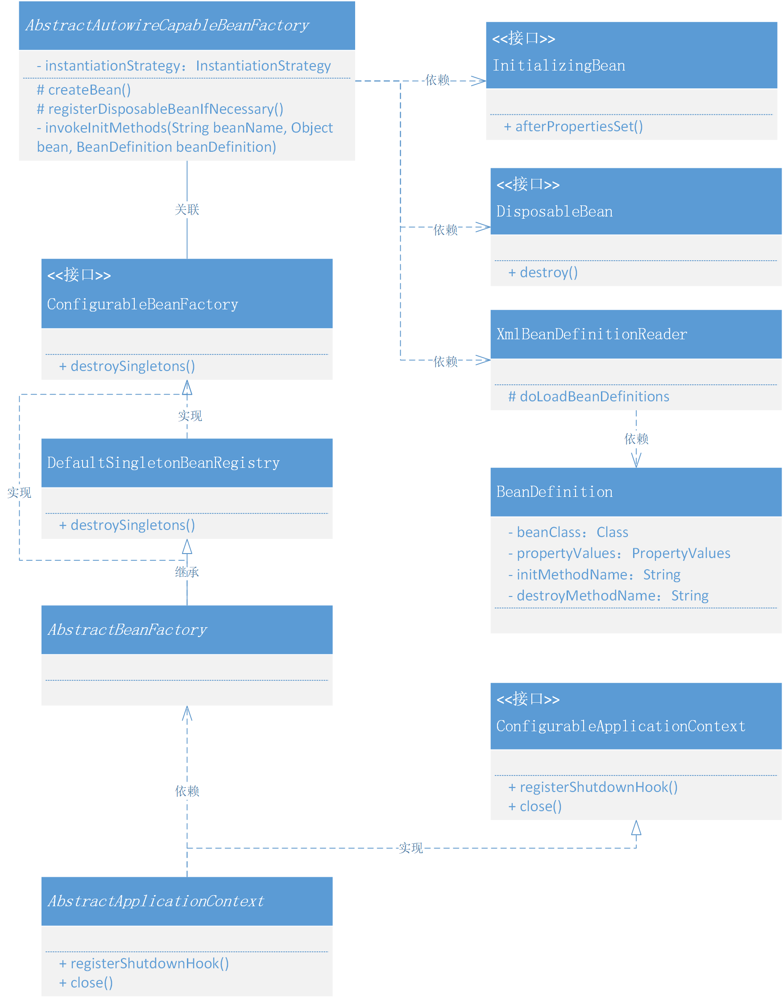

# 向虚拟机注册钩子，实现Bean对象的初始化和销毁方法
可以在 xml 中配置初始化和销毁的方法，也可以通过实现类的方式处理，比如我们在使用 Spring 时用到的 InitializingBean, DisposableBean 两个接口
## 整体设计
- 在 spring.xml 配置中添加 init-method、destroy-method 两个注解，在配置文件加载的过程中，把注解配置一并定义到 BeanDefinition 的属性当中。这样在 initializeBean 初始化操作的工程中，就可以通过反射的方式来调用配置在 Bean 定义属性当中的方法信息了。另外如果是接口实现的方式，那么直接可以通过 Bean 对象调用对应接口定义的方法即可，((InitializingBean) bean).afterPropertiesSet()，两种方式达到的效果是一样的。
- 除了在初始化做的操作外，destroy-method 和 DisposableBean 接口的定义，都会在 Bean 对象初始化完成阶段，执行注册销毁方法的信息到 DefaultSingletonBeanRegistry 类中的 disposableBeans 属性里，这是为了后续统一进行操作。

## 类关系图
Spring 应用上下文和对Bean对象扩展机制的类关系


- 以上整个类图结构描述出来的就是本次新增 Bean 实例化过程中的初始化方法和销毁方法。
- 因为我们一共实现了两种方式的初始化和销毁方法，xml配置和定义接口，所以这里既有 InitializingBean、DisposableBean 也有需要 XmlBeanDefinitionReader 加载 spring.xml 配置信息到 BeanDefinition 中。
- 另外接口 ConfigurableBeanFactory 定义了 destroySingletons 销毁方法，并由 AbstractBeanFactory 继承的父类 DefaultSingletonBeanRegistry 实现 ConfigurableBeanFactory 接口定义的 destroySingletons 方法。这种方式的设计可能数程序员是没有用过的，都是用的谁实现接口谁完成实现类，而不是把实现接口的操作又交给继承的父类处理。所以这块还是蛮有意思的，是一种不错的隔离分层服务的设计方式
- 最后就是关于向虚拟机注册钩子，保证在虚拟机关闭之前，执行销毁操作。Runtime.getRuntime().addShutdownHook(new Thread(() -> System.out.println("close！")));

## 代码实现
### 定义初始化和销毁方法的接口
```java
public interface InitializingBean {

    /**
     * Bean 处理了属性填充后调用
     * 
     * @throws Exception
     */
    void afterPropertiesSet() throws Exception;

}
```
```java
public interface DisposableBean {

    void destroy() throws Exception;

}
```
- InitializingBean、DisposableBean，两个接口方法还是比较常用的，在一些需要结合 Spring 实现的组件中，经常会使用这两个方法来做一些参数的初始化和销毁操作。比如接口暴漏、数据库数据读取、配置文件加载等等。

### Bean属性定义新增初始化和销毁
```java
public class BeanDefinition {

    private Class beanClass;

    private PropertyValues propertyValues;

    private String initMethodName;
    
    private String destroyMethodName;
    
    // ...get/set
}
```
- 在 BeanDefinition 新增加了两个属性：initMethodName、destroyMethodName，这两个属性是为了在 spring.xml 配置的 Bean 对象中，可以配置 init-method="initDataMethod" destroy-method="destroyDataMethod" 操作，最终实现接口的效果是一样的。只不过一个是接口方法的直接调用，另外是一个在配置文件中读取到方法反射调用

```java
public class XmlBeanDefinitionReader extends AbstractBeanDefinitionReader {

    //Constructor

    //其他方法
    
    //doLoadBeanDefinitions中增加对init-method、destroy-method的读取
    protected void doLoadBeanDefinitions(InputStream inputStream) throws ClassNotFoundException{
        Document doc = XmlUtil.readXML(inputStream);
        Element root = doc.getDocumentElement();
        NodeList childNodes = root.getChildNodes();

        for (int i = 0; i < childNodes.getLength(); i++) {
            if (!(childNodes.item(i) instanceof Element)) {
                continue;
            }
            if (!"bean".equals(childNodes.item(i).getNodeName())) {
                continue;
            }

            Element bean = (Element) childNodes.item(i);
            String id = bean.getAttribute("id");
            String name = bean.getAttribute("name");
            String className = bean.getAttribute("class");
            
            //增加对init-method、destroy-method的读取
            String initMethod = bean.getAttribute("init-method");
            String destroyMethodName = bean.getAttribute("destroy-method");

            Class<?> clazz = Class.forName(className);
            String beanName = StrUtil.isNotEmpty(id) ? id : name;
            if (StrUtil.isEmpty(beanName)){
                beanName = StrUtil.lowerFirst(clazz.getSimpleName());
            }

            BeanDefinition beanDefinition = new BeanDefinition(clazz);
            
            //额外设置到beanDefinition中
            beanDefinition.setInitMethodName(initMethod);
            beanDefinition.setDestroyMethodName(destroyMethodName);

            for (int j = 0; j < bean.getChildNodes().getLength(); j++) {
                if (!(bean.getChildNodes().item(j) instanceof Element)) {
                    continue;
                }
                if (!"property".equals(bean.getChildNodes().item(j).getNodeName())) {
                    continue;
                }
                //解析标签：property
                Element property = (Element) bean.getChildNodes().item(j);
                String attrName = property.getAttribute("name");
                String attrValue = property.getAttribute("value");
                String attrRef = property.getAttribute("ref");
                Object value = StrUtil.isNotEmpty(attrRef) ? new BeanReference(attrRef) : attrValue;
                PropertyValue propertyValue = new PropertyValue(attrName, value);
                beanDefinition.getPropertyValues().addPropertyValue(propertyValue);
            }

            if (getRegistry().containsBeanDefinition(beanName)) {
                throw new BeansException("Duplicate beanName["+beanName+"] is not allowed");
            }
            getRegistry().registerBeanDefinition(beanName,beanDefinition);
        }
    }
}
```
- Bean属性定义增加初始化和销毁后，还需要在XmlBeanDefinitionReader类中，增加对新增属性的读取，并添加到BeanDefinition中

### 执行 Bean 对象的初始化方法
```java
public abstract class AbstractAutowireCapableBeanFactory extends AbstractBeanFactory implements AutowireCapableBeanFactory {

    private InstantiationStrategy instantiationStrategy = new CglibSubclassingInstantiationStrategy();

    @Override
    protected Object createBean(String beanName, BeanDefinition beanDefinition, Object[] args) throws BeansException {
        Object bean = null;
        try {
            bean = createBeanInstance(beanDefinition, beanName, args);
            // 给 Bean 填充属性
            applyPropertyValues(beanName, bean, beanDefinition);
            // 执行 Bean 的初始化方法和 BeanPostProcessor 的前置和后置处理方法
            bean = initializeBean(beanName, bean, beanDefinition);
        } catch (Exception e) {
            throw new BeansException("Instantiation of bean failed", e);
        }

        // ...

        addSingleton(beanName, bean);
        return bean;
    }

    private Object initializeBean(String beanName, Object bean, BeanDefinition beanDefinition) {
        // 1. 执行 BeanPostProcessor Before 处理
        Object wrappedBean = applyBeanPostProcessorsBeforeInitialization(bean, beanName);

        // 执行 Bean 对象的初始化方法
        try {
            invokeInitMethods(beanName, wrappedBean, beanDefinition);
        } catch (Exception e) {
            throw new BeansException("Invocation of init method of bean[" + beanName + "] failed", e);
        }

        // 2. 执行 BeanPostProcessor After 处理
        wrappedBean = applyBeanPostProcessorsAfterInitialization(bean, beanName);
        return wrappedBean;
    }

    private void invokeInitMethods(String beanName, Object bean, BeanDefinition beanDefinition) throws Exception {
        // 1. 实现接口 InitializingBean
        if (bean instanceof InitializingBean) {
            ((InitializingBean) bean).afterPropertiesSet();
        }

        // 2. 配置信息 init-method {判断是为了避免二次执行销毁}
        String initMethodName = beanDefinition.getInitMethodName();
        if (StrUtil.isNotEmpty(initMethodName)) {
            Method initMethod = beanDefinition.getBeanClass().getMethod(initMethodName);
            if (null == initMethod) {
                throw new BeansException("Could not find an init method named '" + initMethodName + "' on bean with name '" + beanName + "'");
            }
            initMethod.invoke(bean);
        }
    }

}
```
- 抽象类 AbstractAutowireCapableBeanFactory 中的 createBean 是用来创建 Bean 对象的方法，在这个方法中我们之前已经扩展了 BeanFactoryPostProcessor、BeanPostProcessor 操作，这里我们继续完善执行 Bean 对象的初始化方法的处理动作。
- 在方法 invokeInitMethods 中，主要分为两块来执行实现了 InitializingBean 接口的操作，处理 afterPropertiesSet 方法。另外一个是判断配置信息 init-method 是否存在，执行反射调用 initMethod.invoke(bean)。这两种方式都可以在 Bean 对象初始化过程中进行处理加载 Bean 对象中的初始化操作，让使用者可以额外新增加自己想要的动作。

### 定义销毁方法适配器(接口和配置)
```java
public class DisposableBeanAdapter implements DisposableBean {

    private final Object bean;
    private final String beanName;
    private String destroyMethodName;

    public DisposableBeanAdapter(Object bean, String beanName, BeanDefinition beanDefinition) {
        this.bean = bean;
        this.beanName = beanName;
        this.destroyMethodName = beanDefinition.getDestroyMethodName();
    }

    @Override
    public void destroy() throws Exception {
        // 1. 实现接口 DisposableBean
        if (bean instanceof DisposableBean) {
            ((DisposableBean) bean).destroy();
        }

        // 2. 配置信息 destroy-method {判断是为了避免二次执行销毁}
        if (StrUtil.isNotEmpty(destroyMethodName) && !(bean instanceof DisposableBean && "destroy".equals(this.destroyMethodName))) {
            Method destroyMethod = bean.getClass().getMethod(destroyMethodName);
            if (null == destroyMethod) {
                throw new BeansException("Couldn't find a destroy method named '" + destroyMethodName + "' on bean with name '" + beanName + "'");
            }
            destroyMethod.invoke(bean);
        }
        
    }

}
```

### 创建Bean时注册销毁方法对象
```java
public abstract class AbstractAutowireCapableBeanFactory extends AbstractBeanFactory implements AutowireCapableBeanFactory {

    private InstantiationStrategy instantiationStrategy = new CglibSubclassingInstantiationStrategy();

    @Override
    protected Object createBean(String beanName, BeanDefinition beanDefinition, Object[] args) throws BeansException {
        Object bean = null;
        try {
            bean = createBeanInstance(beanDefinition, beanName, args);
            // 给 Bean 填充属性
            applyPropertyValues(beanName, bean, beanDefinition);
            // 执行 Bean 的初始化方法和 BeanPostProcessor 的前置和后置处理方法
            bean = initializeBean(beanName, bean, beanDefinition);
        } catch (Exception e) {
            throw new BeansException("Instantiation of bean failed", e);
        }

        // 注册实现了 DisposableBean 接口的 Bean 对象
        registerDisposableBeanIfNecessary(beanName, bean, beanDefinition);

        addSingleton(beanName, bean);
        return bean;
    }

    protected void registerDisposableBeanIfNecessary(String beanName, Object bean, BeanDefinition beanDefinition) {
        if (bean instanceof DisposableBean || StrUtil.isNotEmpty(beanDefinition.getDestroyMethodName())) {
            registerDisposableBean(beanName, new DisposableBeanAdapter(bean, beanName, beanDefinition));
        }
    }

}
```
- 在创建 Bean 对象的实例的时候，需要把销毁方法保存起来，方便后续执行销毁动作进行调用。
- 那么这个销毁方法的具体方法信息，会被注册到 DefaultSingletonBeanRegistry 中新增加的 Map<String, DisposableBean> disposableBeans 属性中去，因为这个接口的方法最终可以被类 AbstractApplicationContext 的 close 方法通过 getBeanFactory().destroySingletons() 调用。
- 在注册销毁方法的时候，会根据是接口类型和配置类型统一交给 DisposableBeanAdapter 销毁适配器类来做统一处理。实现了某个接口的类可以被 instanceof 判断或者强转后调用接口方法

### 虚拟机关闭钩子注册调用销毁方法
```java
public interface ConfigurableApplicationContext extends ApplicationContext {

    void refresh() throws BeansException;

    void registerShutdownHook();

    void close();

}
```
- 首先我们需要在 ConfigurableApplicationContext 接口中定义注册虚拟机钩子的方法 registerShutdownHook 和手动执行关闭的方法 close。

```java
public abstract class AbstractApplicationContext extends DefaultResourceLoader implements ConfigurableApplicationContext {

    // ...

    @Override
    public void registerShutdownHook() {
        Runtime.getRuntime().addShutdownHook(new Thread(this::close));
    }

    @Override
    public void close() {
        getBeanFactory().destroySingletons();
    }

}
```
- 这里主要体现了关于注册钩子和关闭的方法实现，上文提到过的 Runtime.getRuntime().addShutdownHook，可以尝试验证。在一些中间件和监控系统的设计中也可以用得到，比如监测服务器宕机，执行备机启动操作。

## 测试代码
### 测试准备
```java
public class UserDao08 {

    private static Map<String, String> hashMap = new HashMap<>();

    public void initDataMethod(){
        System.out.println("执行：init-method");
        hashMap.put("10001", "李四");
        hashMap.put("10002", "张三");
        hashMap.put("10003", "王五");
    }

    public void destroyDataMethod(){
        System.out.println("执行：destroy-method");
        hashMap.clear();
    }

    public String queryUserName(String uId) {
        return hashMap.get(uId);
    }

}
```
```java
public class UserService08 implements InitializingBean, DisposableBean {

    private String uId;
    private String company;
    private String location;
    private UserDao08 userDao;

    @Override
    public void destroy() throws Exception {
        System.out.println("执行：UserService.destroy");
    }

    @Override
    public void afterPropertiesSet() throws Exception {
        System.out.println("执行：UserService.afterPropertiesSet");
    }

    public String queryUserInfo() {
        return userDao.queryUserName(uId) + "," + company + "," + location;
    }

    public String getuId() {
        return uId;
    }

    public void setuId(String uId) {
        this.uId = uId;
    }

    public String getCompany() {
        return company;
    }

    public void setCompany(String company) {
        this.company = company;
    }

    public String getLocation() {
        return location;
    }

    public void setLocation(String location) {
        this.location = location;
    }

    public UserDao08 getUserDao() {
        return userDao;
    }

    public void setUserDao(UserDao08 userDao) {
        this.userDao = userDao;
    }
}
```

### 配置文件
```xml
<?xml version="1.0" encoding="UTF-8"?>
<beans>

    <bean id="userDao" class="com.lile.springframework.test.bean.UserDao08" init-method="initDataMethod" destroy-method="destroyDataMethod"/>

    <bean id="userService08" class="com.lile.springframework.test.bean.UserService08">
        <property name="uId" value="10001"/>
        <property name="company" value="腾讯"/>
        <property name="location" value="深圳"/>
        <property name="userDao" ref="userDao"/>
    </bean>

</beans>
```
- 配置文件中主要是新增了，init-method="initDataMethod" destroy-method="destroyDataMethod"，这样两个配置。从源码的学习中可以知道，这两个配置是为了加入到 BeanDefinition 定义类之后写入到类 DefaultListableBeanFactory 中的 beanDefinitionMap 属性中去。

### 测试用例
```java
@Test
public void test_xml() {
    // 1.初始化 BeanFactory
    ClassPathXmlApplicationContext applicationContext = new ClassPathXmlApplicationContext("classpath:spring08.xml");
    applicationContext.registerShutdownHook();

    // 2. 获取Bean对象调用方法
    UserService08 userService = applicationContext.getBean("userService08", UserService08.class);
    String result = userService.queryUserInfo();
    System.out.println("测试结果：" + result);
}

@Test
public void test_hook() {
    Runtime.getRuntime().addShutdownHook(new Thread(() -> System.out.println("close！")));
}
```