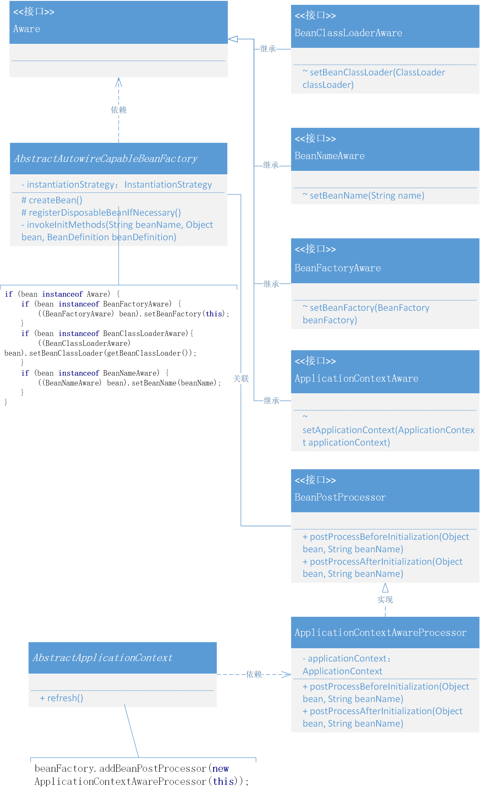

# 定义标记类型Aware接口，实现感知容器对象
> 目前已实现的 Spring 框架，在 Bean 操作上能提供出的能力，包括：Bean 对象的定义和注册，以及在操作 Bean 对象过程中执行的，BeanFactoryPostProcessor、BeanPostProcessor、InitializingBean、DisposableBean，以及在 XML 新增的一些配置处理，让我们可以 Bean 对象有更强的操作性。
>
如果我们想获得 Spring 框架提供的 BeanFactory、ApplicationContext、BeanClassLoader等这些能力做一些扩展框架的使用时该怎么操作呢?

本章节希望在 Spring 框架中提供一种能感知容器操作的接口，如果谁实现了这样的一个接口，就可以获取接口入参中的各类能力

## 整体设计
- 定义接口 Aware，在 Spring 框架中它是一种感知标记性接口，具体的子类定义和实现能感知容器中的相关对象。也就是通过这个桥梁，向具体的实现类中提供容器服务
- 继承 Aware 的接口包括：BeanFactoryAware、BeanClassLoaderAware、BeanNameAware和ApplicationContextAware，当然在 Spring 源码中还有一些其他关于注解的，不过目前我们还是用不到。

## 类关系图
Spring 感知接口的设计和实现类关系

- Aware 有四个继承的接口，其他这些接口的继承都是为了继承一个标记，有了标记的存在更方便类的操作和具体判断实现。
- 另外由于 ApplicationContext 并不是在 AbstractAutowireCapableBeanFactory 中 createBean 方法下的内容，所以需要像容器中注册 addBeanPostProcessor ，再由 createBean 统一调用 applyBeanPostProcessorsBeforeInitialization 时进行操作。

## 代码实现
### 定义标记接口
```java
/**
 * Marker superinterface indicating that a bean is eligible to be
 * notified by the Spring container of a particular framework object
 * through a callback-style method.  Actual method signature is
 * determined by individual subinterfaces, but should typically
 * consist of just one void-returning method that accepts a single
 * argument.
 *
 * 标记类接口，实现该接口可以被Spring容器感知
 *
 */
public interface Aware {
}
```
- 在 Spring 中有特别多类似这样的标记接口的设计方式，它们的存在就像是一种标签一样，可以方便统一摘取出属于此类接口的实现类，通常会有 instanceof 一起判断使用。

### 容器感知类
```java
public interface BeanFactoryAware extends Aware {

   void setBeanFactory(BeanFactory beanFactory) throws BeansException;

}
```
```java
public interface BeanClassLoaderAware extends Aware {

    void setBeanClassLoader(ClassLoader classLoader);

}
```
```java
public interface BeanNameAware extends Aware {

    void setBeanName(String name);

}
```
```java
public interface ApplicationContextAware extends Aware {

    void setApplicationContext(ApplicationContext applicationContext) throws BeansException;

}
```

### 包装处理器
```java
public class ApplicationContextAwareProcessor implements BeanPostProcessor {

    private final ApplicationContext applicationContext;

    public ApplicationContextAwareProcessor(ApplicationContext applicationContext) {
        this.applicationContext = applicationContext;
    }

    @Override
    public Object postProcessBeforeInitialization(Object bean, String beanName) throws BeansException {
        if (bean instanceof ApplicationContextAware){
            ((ApplicationContextAware) bean).setApplicationContext(applicationContext);
        }
        return bean;
    }

    @Override
    public Object postProcessAfterInitialization(Object bean, String beanName) throws BeansException {
        return bean;
    }

}
```
- 由于 ApplicationContext 的获取并不能直接在创建 Bean 时候就可以拿到，所以需要在 refresh 操作时，把 ApplicationContext 写入到一个包装的 BeanPostProcessor 中去，再由 AbstractAutowireCapableBeanFactory.applyBeanPostProcessorsBeforeInitialization 方法调用

### 注册 BeanPostProcessor
```java
public abstract class AbstractApplicationContext extends DefaultResourceLoader implements ConfigurableApplicationContext {

    @Override
    public void refresh() throws BeansException {
        // 1. 创建 BeanFactory，并加载 BeanDefinition
        refreshBeanFactory();

        // 2. 获取 BeanFactory
        ConfigurableListableBeanFactory beanFactory = getBeanFactory();

        // 3. 添加 ApplicationContextAwareProcessor，让继承自 ApplicationContextAware 的 Bean 对象都能感知所属的 ApplicationContext
        beanFactory.addBeanPostProcessor(new ApplicationContextAwareProcessor(this));

        // 4. 在 Bean 实例化之前，执行 BeanFactoryPostProcessor (Invoke factory processors registered as beans in the context.)
        invokeBeanFactoryPostProcessors(beanFactory);

        // 5. BeanPostProcessor 需要提前于其他 Bean 对象实例化之前执行注册操作
        registerBeanPostProcessors(beanFactory);

        // 6. 提前实例化单例Bean对象
        beanFactory.preInstantiateSingletons();
    }
    
 	// ...   
}
```
- refresh() 方法就是整个 Spring 容器的操作过程，与上一章节对比，本次新增加了关于 addBeanPostProcessor 的操作。
- 添加 ApplicationContextAwareProcessor，让继承自 ApplicationContextAware 的 Bean 对象都能感知所属的 ApplicationContext。
### 感知调用操作
```java
public abstract class AbstractAutowireCapableBeanFactory extends AbstractBeanFactory implements AutowireCapableBeanFactory {

    private InstantiationStrategy instantiationStrategy = new CglibSubclassingInstantiationStrategy();

    @Override
    protected Object createBean(String beanName, BeanDefinition beanDefinition, Object[] args) throws BeansException {
        Object bean = null;
        try {
            bean = createBeanInstance(beanDefinition, beanName, args);
            // 给 Bean 填充属性
            applyPropertyValues(beanName, bean, beanDefinition);
            // 执行 Bean 的初始化方法和 BeanPostProcessor 的前置和后置处理方法
            bean = initializeBean(beanName, bean, beanDefinition);
        } catch (Exception e) {
            throw new BeansException("Instantiation of bean failed", e);
        }

        // 注册实现了 DisposableBean 接口的 Bean 对象
        registerDisposableBeanIfNecessary(beanName, bean, beanDefinition);

        addSingleton(beanName, bean);
        return bean;
    }

    private Object initializeBean(String beanName, Object bean, BeanDefinition beanDefinition) {

        // invokeAwareMethods
        if (bean instanceof Aware) {
            if (bean instanceof BeanFactoryAware) {
                ((BeanFactoryAware) bean).setBeanFactory(this);
            }
            if (bean instanceof BeanClassLoaderAware){
                ((BeanClassLoaderAware) bean).setBeanClassLoader(getBeanClassLoader());
            }
            if (bean instanceof BeanNameAware) {
                ((BeanNameAware) bean).setBeanName(beanName);
            }
        }

        // 1. 执行 BeanPostProcessor Before 处理
        Object wrappedBean = applyBeanPostProcessorsBeforeInitialization(bean, beanName);

        // 执行 Bean 对象的初始化方法
        try {
            invokeInitMethods(beanName, wrappedBean, beanDefinition);
        } catch (Exception e) {
            throw new BeansException("Invocation of init method of bean[" + beanName + "] failed", e);
        }

        // 2. 执行 BeanPostProcessor After 处理
        wrappedBean = applyBeanPostProcessorsAfterInitialization(bean, beanName);
        return wrappedBean;
    }


    @Override
    public Object applyBeanPostProcessorsBeforeInitialization(Object existingBean, String beanName) throws BeansException {
        Object result = existingBean;
        for (BeanPostProcessor processor : getBeanPostProcessors()) {
            Object current = processor.postProcessBeforeInitialization(result, beanName);
            if (null == current) return result;
            result = current;
        }
        return result;
    }

    @Override
    public Object applyBeanPostProcessorsAfterInitialization(Object existingBean, String beanName) throws BeansException {
        Object result = existingBean;
        for (BeanPostProcessor processor : getBeanPostProcessors()) {
            Object current = processor.postProcessAfterInitialization(result, beanName);
            if (null == current) return result;
            result = current;
        }
        return result;
    }

}
```
```java
public abstract class AbstractBeanFactory extends DefaultSingletonBeanRegistry implements ConfigurableBeanFactory {

    /**
     * ClassLoader to resolve bean class names with, if necessary
     */
    private ClassLoader beanClassLoader = ClassUtils.getDefaultClassLoader();

    //...

    public ClassLoader getBeanClassLoader() {
        return this.beanClassLoader;
    }
}
```

## 测试代码
### 测试准备
```java
public class UserDao08 {

    private static Map<String, String> hashMap = new HashMap<>();

    public void initDataMethod(){
        System.out.println("执行：init-method");
        hashMap.put("10001", "李四");
        hashMap.put("10002", "张三");
        hashMap.put("10003", "王五");
    }

    public void destroyDataMethod(){
        System.out.println("执行：destroy-method");
        hashMap.clear();
    }

    public String queryUserName(String uId) {
        return hashMap.get(uId);
    }

}
```

```java
public class UserService09 implements BeanNameAware, BeanClassLoaderAware, ApplicationContextAware, BeanFactoryAware {
    private ApplicationContext applicationContext;
    private BeanFactory beanFactory;

    private String uId;
    private String company;
    private String location;
    private UserDao08 userDao;

    @Override
    public void setBeanFactory(BeanFactory beanFactory) throws BeansException {
        this.beanFactory = beanFactory;
    }

    @Override
    public void setApplicationContext(ApplicationContext applicationContext) throws BeansException {
        this.applicationContext = applicationContext;
    }

    @Override
    public void setBeanName(String name) {
        System.out.println("Bean Name is：" + name);
    }

    @Override
    public void setBeanClassLoader(ClassLoader classLoader) {
        System.out.println("ClassLoader：" + classLoader);
    }

    public String queryUserInfo() {
        return userDao.queryUserName(uId) + "," + company + "," + location;
    }

    public String getuId() {
        return uId;
    }

    public void setuId(String uId) {
        this.uId = uId;
    }

    public String getCompany() {
        return company;
    }

    public void setCompany(String company) {
        this.company = company;
    }

    public String getLocation() {
        return location;
    }

    public void setLocation(String location) {
        this.location = location;
    }

    public UserDao08 getUserDao() {
        return userDao;
    }

    public void setUserDao(UserDao08 userDao) {
        this.userDao = userDao;
    }


    public ApplicationContext getApplicationContext() {
        return applicationContext;
    }

    public BeanFactory getBeanFactory() {
        return beanFactory;
    }

}
```

### 配置文件
```xml
<?xml version="1.0" encoding="UTF-8"?>
<beans>

    <bean id="userDao" class="com.lile.springframework.test.bean.UserDao08" init-method="initDataMethod" destroy-method="destroyDataMethod"/>

    <bean id="userService" class="com.lile.springframework.test.bean.UserService09">
        <property name="uId" value="10001"/>
        <property name="company" value="腾讯"/>
        <property name="location" value="深圳"/>
        <property name="userDao" ref="userDao"/>
    </bean>

</beans>
```

### 测试用例
````java
@Test
public void test_xml() {
    // 1.初始化 BeanFactory
    ClassPathXmlApplicationContext applicationContext = new ClassPathXmlApplicationContext("classpath:spring09.xml");
    applicationContext.registerShutdownHook();

    // 2. 获取Bean对象调用方法
    UserService09 userService = applicationContext.getBean("userService", UserService09.class);
    String result = userService.queryUserInfo();
    System.out.println("测试结果：" + result);

    System.out.println("ApplicationContextAware：" + userService.getApplicationContext());
    System.out.println("BeanFactoryAware：" + userService.getBeanFactory());
}
````