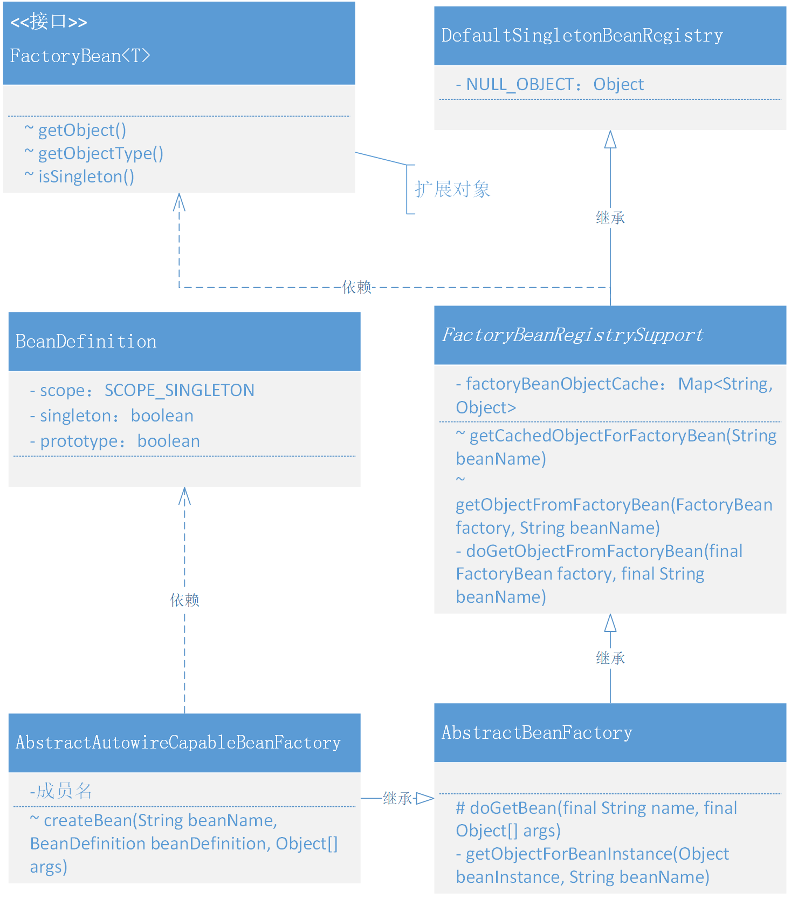

# 关于Bean对象作用域以及FactoryBean的实现和使用

## 整体设计
- 整个的实现过程包括了两部分，一个解决单例还是原型对象，另外一个处理 FactoryBean 类型对象创建过程中关于获取具体调用对象的 getObject 操作。
- SCOPE_SINGLETON、SCOPE_PROTOTYPE，对象类型的创建获取方式，主要区分在于 AbstractAutowireCapableBeanFactory#createBean 创建完成对象后是否放入到内存中，如果不放入则每次获取都会重新创建。
- createBean 执行对象创建、属性填充、依赖加载、前置后置处理、初始化等操作后，就要开始做执行判断整个对象是否是一个 FactoryBean 对象，如果是这样的对象，就需要再继续执行获取 FactoryBean 具体对象中的 getObject 对象了。整个 getBean 过程中都会新增一个单例类型的判断factory.isSingleton()，用于决定是否使用内存存放对象信息

## 类关系图
Spring 单例、原型以及 FactoryBean 功能实现类关系


## 代码实现
### Bean的作用范围定义和xml解析
```java
public class BeanDefinition {

    String SCOPE_SINGLETON = ConfigurableBeanFactory.SCOPE_SINGLETON;

    String SCOPE_PROTOTYPE = ConfigurableBeanFactory.SCOPE_PROTOTYPE;

    private Class beanClass;

    private PropertyValues propertyValues;

    private String initMethodName;

    private String destroyMethodName;

    private String scope = SCOPE_SINGLETON;

    private boolean singleton = true;

    private boolean prototype = false;

    public BeanDefinition(Class beanClass) {
        this(beanClass, null);
    }

    public BeanDefinition(Class beanClass, PropertyValues propertyValues) {
        this.beanClass = beanClass;
        this.propertyValues = propertyValues != null ? propertyValues : new PropertyValues();
    }

    public void setScope(String scope) {
        this.scope = scope;
        this.singleton = SCOPE_SINGLETON.equals(scope);
        this.prototype = SCOPE_PROTOTYPE.equals(scope);
    }

    // ...get/set
}
```

```java
public class XmlBeanDefinitionReader extends AbstractBeanDefinitionReader {
    
    protected void doLoadBeanDefinitions(InputStream inputStream) throws ClassNotFoundException {
        Document doc = XmlUtil.readXML(inputStream);
        Element root = doc.getDocumentElement();
        NodeList childNodes = root.getChildNodes();

        for (int i = 0; i < childNodes.getLength(); i++) {
            // 判断元素
            if (!(childNodes.item(i) instanceof Element)) continue;
            // 判断对象
            if (!"bean".equals(childNodes.item(i).getNodeName())) continue;

            // 解析标签
            Element bean = (Element) childNodes.item(i);
            String id = bean.getAttribute("id");
            String name = bean.getAttribute("name");
            String className = bean.getAttribute("class");
            String initMethod = bean.getAttribute("init-method");
            String destroyMethodName = bean.getAttribute("destroy-method");
            String beanScope = bean.getAttribute("scope");

            // 获取 Class，方便获取类中的名称
            Class<?> clazz = Class.forName(className);
            // 优先级 id > name
            String beanName = StrUtil.isNotEmpty(id) ? id : name;
            if (StrUtil.isEmpty(beanName)) {
                beanName = StrUtil.lowerFirst(clazz.getSimpleName());
            }

            // 定义Bean
            BeanDefinition beanDefinition = new BeanDefinition(clazz);
            beanDefinition.setInitMethodName(initMethod);
            beanDefinition.setDestroyMethodName(destroyMethodName);

            if (StrUtil.isNotEmpty(beanScope)) {
                beanDefinition.setScope(beanScope);
            }

            // 读取属性并填充
            for (int j = 0; j < bean.getChildNodes().getLength(); j++) {
                if (!(bean.getChildNodes().item(j) instanceof Element)) continue;
                if (!"property".equals(bean.getChildNodes().item(j).getNodeName())) continue;
                // 解析标签：property
                Element property = (Element) bean.getChildNodes().item(j);
                String attrName = property.getAttribute("name");
                String attrValue = property.getAttribute("value");
                String attrRef = property.getAttribute("ref");
                // 获取属性值：引入对象、值对象
                Object value = StrUtil.isNotEmpty(attrRef) ? new BeanReference(attrRef) : attrValue;
                // 创建属性信息
                PropertyValue propertyValue = new PropertyValue(attrName, value);
                beanDefinition.getPropertyValues().addPropertyValue(propertyValue);
            }
            if (getRegistry().containsBeanDefinition(beanName)) {
                throw new BeansException("Duplicate beanName[" + beanName + "] is not allowed");
            }
            // 注册 BeanDefinition
            getRegistry().registerBeanDefinition(beanName, beanDefinition);
        }
    }

}
```
- 在解析 XML 处理类 XmlBeanDefinitionReader 中，新增加了关于 Bean 对象配置中 scope 的解析，并把这个属性信息填充到 Bean 定义中。beanDefinition.setScope(beanScope)

### 创建和修改对象时候判断单例和原型模式
```java
public abstract class AbstractAutowireCapableBeanFactory extends AbstractBeanFactory implements AutowireCapableBeanFactory {

    private InstantiationStrategy instantiationStrategy = new ByteBuddySubclassingInstantiationStrategy();

    @Override
    protected Object createBean(String beanName, BeanDefinition beanDefinition, Object[] args) throws BeansException {
        Object bean = null;
        try {
            bean = createBeanInstance(beanDefinition, beanName, args);
            // 给 Bean 填充属性
            applyPropertyValues(beanName, bean, beanDefinition);
            // 执行 Bean 的初始化方法和 BeanPostProcessor 的前置和后置处理方法
            bean = initializeBean(beanName, bean, beanDefinition);
        } catch (Exception e) {
            throw new BeansException("Instantiation of bean failed", e);
        }

        // 注册实现了 DisposableBean 接口的 Bean 对象
        registerDisposableBeanIfNecessary(beanName, bean, beanDefinition);

        // 判断 SCOPE_SINGLETON、SCOPE_PROTOTYPE
        if (beanDefinition.isSingleton()) {
            addSingleton(beanName, bean);
        }
        return bean;
    }

    protected void registerDisposableBeanIfNecessary(String beanName, Object bean, BeanDefinition beanDefinition) {
        // 非 Singleton 类型的 Bean 不执行销毁方法
        if (!beanDefinition.isSingleton()) return;

        if (bean instanceof DisposableBean || StrUtil.isNotEmpty(beanDefinition.getDestroyMethodName())) {
            registerDisposableBean(beanName, new DisposableBeanAdapter(bean, beanName, beanDefinition));
        }
    }

    // ... 

}
```
- 单例模式和原型模式的区别就在于是否存放到内存中，如果是原型模式那么就不会存放到内存中，每次获取都重新创建对象，另外非 Singleton 类型的 Bean 不需要执行销毁方法。
- 所以这里的代码会有两处修改，一处是 createBean 中判断是否添加到 addSingleton(beanName, bean);，另外一处是 registerDisposableBeanIfNecessary 销毁注册中的判断 if (!beanDefinition.isSingleton()) return;。

### 定义 FactoryBean 接口
```java
public interface FactoryBean<T> {

    T getObject() throws Exception;

    Class<?> getObjectType();

    boolean isSingleton();

}
```
### 实现一个 FactoryBean 注册服务
```java
public abstract class FactoryBeanRegistrySupport extends DefaultSingletonBeanRegistry {

    /**
     * Cache of singleton objects created by FactoryBeans: FactoryBean name --> object
     */
    private final Map<String, Object> factoryBeanObjectCache = new ConcurrentHashMap<String, Object>();

    protected Object getCachedObjectForFactoryBean(String beanName) {
        Object object = this.factoryBeanObjectCache.get(beanName);
        return (object != NULL_OBJECT ? object : null);
    }

    protected Object getObjectFromFactoryBean(FactoryBean factory, String beanName) {
        if (factory.isSingleton()) {
            Object object = this.factoryBeanObjectCache.get(beanName);
            if (object == null) {
                object = doGetObjectFromFactoryBean(factory, beanName);
                this.factoryBeanObjectCache.put(beanName, (object != null ? object : NULL_OBJECT));
            }
            return (object != NULL_OBJECT ? object : null);
        } else {
            return doGetObjectFromFactoryBean(factory, beanName);
        }
    }

    private Object doGetObjectFromFactoryBean(final FactoryBean factory, final String beanName){
        try {
            return factory.getObject();
        } catch (Exception e) {
            throw new BeansException("FactoryBean threw exception on object[" + beanName + "] creation", e);
        }
    }

}
```
- FactoryBeanRegistrySupport 类主要处理的就是关于 FactoryBean 此类对象的注册操作，之所以放到这样一个单独的类里，就是希望做到不同领域模块下只负责各自需要完成的功能，避免因为扩展导致类膨胀到难以维护。
- 同样这里也定义了缓存操作 factoryBeanObjectCache，用于存放单例类型的对象，避免重复创建。在日常使用用，基本也都是创建的单例对象
- doGetObjectFromFactoryBean 是具体的获取 FactoryBean#getObject() 方法，因为既有缓存的处理也有对象的获取，所以额外提供了 getObjectFromFactoryBean 进行逻辑包装，这部分的操作方式是不和你日常做的业务逻辑开发非常相似。从Redis取数据，如果为空就从数据库获取并写入Redis
### 扩展 AbstractBeanFactory 创建对象逻辑
```java
public abstract class AbstractBeanFactory extends FactoryBeanRegistrySupport implements ConfigurableBeanFactory {

    // ...

    protected <T> T doGetBean(final String name, final Object[] args) {
        Object sharedInstance = getSingleton(name);
        if (sharedInstance != null) {
            // 如果是 FactoryBean，则需要调用 FactoryBean#getObject
            return (T) getObjectForBeanInstance(sharedInstance, name);
        }

        BeanDefinition beanDefinition = getBeanDefinition(name);
        Object bean = createBean(name, beanDefinition, args);
        return (T) getObjectForBeanInstance(bean, name);
    }

    private Object getObjectForBeanInstance(Object beanInstance, String beanName) {
        if (!(beanInstance instanceof FactoryBean)) {
            return beanInstance;
        }

        Object object = getCachedObjectForFactoryBean(beanName);

        if (object == null) {
            FactoryBean<?> factoryBean = (FactoryBean<?>) beanInstance;
            object = getObjectFromFactoryBean(factoryBean, beanName);
        }

        return object;
    }

    // ...

}
```
- 首先这里把 AbstractBeanFactory 原来继承的 DefaultSingletonBeanRegistry，修改为继承 FactoryBeanRegistrySupport。因为需要扩展出创建 FactoryBean 对象的能力，所以这就想一个链条服务上，截出一个段来处理额外的服务，并把链条再链接上。
- 此处新增加的功能主要是在 doGetBean 方法中，添加了调用 (T) getObjectForBeanInstance(sharedInstance, name) 对获取 FactoryBean 的操作。
- 在 getObjectForBeanInstance 方法中做具体的 instanceof 判断，另外还会从 FactoryBean 的缓存中获取对象，如果不存在则调用 FactoryBeanRegistrySupport#getObjectFromFactoryBean，执行具体的操作。

## 测试代码
### 测试准备
```java
public interface IUser {
    String queryUserName(String uId);
}
```

```java
public class UserService10 {

    private String uId;
    private String company;
    private String location;
    private IUser user;

    public String queryUserInfo() {
        return user.queryUserName(uId) + "," + company + "," + location;
    }

    public String getuId() {
        return uId;
    }

    public void setuId(String uId) {
        this.uId = uId;
    }

    public String getCompany() {
        return company;
    }

    public void setCompany(String company) {
        this.company = company;
    }

    public String getLocation() {
        return location;
    }

    public void setLocation(String location) {
        this.location = location;
    }

    public IUser getUser() {
        return user;
    }

    public void setUser(IUser user) {
        this.user = user;
    }
}
```

### 定义 FactoryBean 对象
```java
public class ProxyBeanFactory implements FactoryBean<IUser> {

    @Override
    public IUser getObject() throws Exception {
        InvocationHandler handler = (proxy, method, args) -> {
            Map<String, String> hashMap = new HashMap<>();
            hashMap.put("10001", "李四");
            hashMap.put("10002", "张三");
            hashMap.put("10003", "王五");
            return "你被代理了 " + method.getName() + "：" + hashMap.get(args[0].toString());
        };
        return (IUser) Proxy.newProxyInstance(Thread.currentThread().getContextClassLoader(), new Class[]{IUser.class}, handler);
    }

    @Override
    public Class<?> getObjectType() {
        return IUser.class;
    }

    @Override
    public boolean isSingleton() {
        return true;
    }

}
```
- 这是一个实现接口 FactoryBean 的代理类 ProxyBeanFactory 名称，主要是模拟了 UserDao 的原有功能，类似于 MyBatis 框架中的代理操作。
- getObject() 中提供的就是一个 InvocationHandler 的代理对象，当有方法调用的时候，则执行代理对象的功能。

### 配置文件
```xml
<?xml version="1.0" encoding="UTF-8"?>
<beans>

    <bean id="userService" class="com.lile.springframework.test.bean.UserService10" scope="prototype">
        <property name="uId" value="10001"/>
        <property name="company" value="腾讯"/>
        <property name="location" value="深圳"/>
        <property name="user" ref="proxyUser"/>
    </bean>

    <bean id="proxyUser" class="com.lile.springframework.test.bean.ProxyBeanFactory"/>

</beans>
```

### 单元测试(单例&原型)
```java
@Test
public void test_prototype() {
    // 1. 初始化 BeanFactory
    ClassPathXmlApplicationContext applicationContext = new ClassPathXmlApplicationContext("classpath:spring10.xml");
    applicationContext.registerShutdownHook();

    // 2. 获取Bean对象调用方法
    UserService10 userService01 = applicationContext.getBean("userService", UserService10.class);
    UserService10 userService02 = applicationContext.getBean("userService", UserService10.class);

    // 3. 配置 scope="prototype/singleton"
    System.out.println(userService01);
    System.out.println(userService02);

    // 4. 打印十六进制哈希
    System.out.println(userService01 + " 十六进制哈希：" + Integer.toHexString(userService01.hashCode()));
    System.out.println(ClassLayout.parseInstance(userService01).toPrintable());
}
```

### 单元测试(代理对象)
```java
@Test
public void test_factory_bean() {
    // 1.初始化 BeanFactory
    ClassPathXmlApplicationContext applicationContext = new ClassPathXmlApplicationContext("classpath:spring10.xml");
    applicationContext.registerShutdownHook();
    
    // 2. 调用代理方法
    UserService10 userService = applicationContext.getBean("userService", UserService10.class);
    System.out.println("测试结果：" + userService.queryUserInfo());
}
```