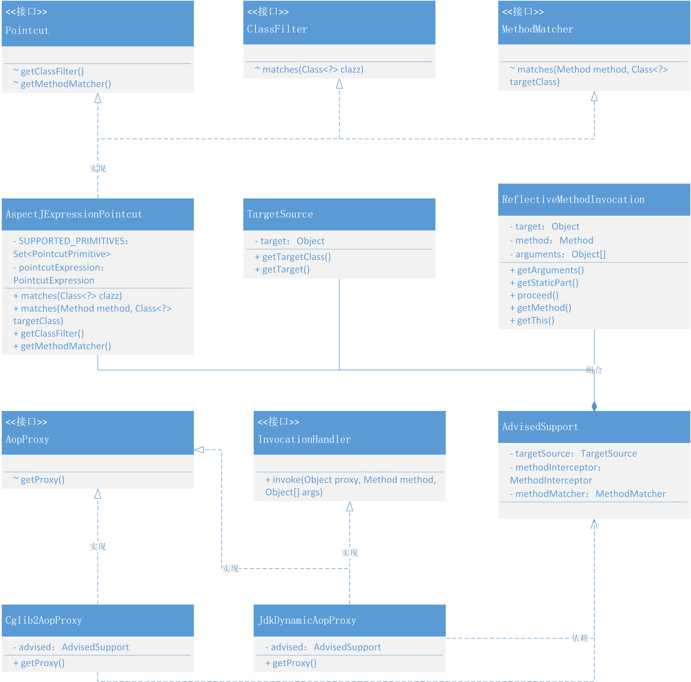

# 基于JDK和Cglib动态代理，实现AOP核心功能
## 整体设计
- 就像你在使用 Spring 的 AOP 一样，只处理一些需要被拦截的方法。在拦截方法后，执行你对方法的扩展操作。
- 那么我们就需要先来实现一个可以代理方法的 Proxy，其实代理方法主要是使用到方法拦截器类处理方法的调用 MethodInterceptor#invoke，而不是直接使用 invoke 方法中的入参 Method method 进行 method.invoke(targetObj, args) 这块是整个使用时的差异。
- 除了以上的核心功能实现，还需要使用到 org.aspectj.weaver.tools.PointcutParser 处理拦截表达式 "execution(* cn.bugstack.springframework.test.bean.IUserService.*(..))"，有了方法代理和处理拦截，我们就可以完成设计出一个 AOP 的雏形了。

## 类关系图
AOP 切点表达式和使用以及基于 JDK 和 CGLIB 的动态代理类关系


- 整个类关系图就是 AOP 实现核心逻辑的地方，上面部分是关于方法的匹配实现，下面从 AopProxy 开始是关于方法的代理操作。
- AspectJExpressionPointcut 的核心功能主要依赖于 aspectj 组件并处理 Pointcut、ClassFilter,、MethodMatcher 接口实现，专门用于处理类和方法的匹配过滤操作。
- AopProxy 是代理的抽象对象，它的实现主要是基于 JDK 的代理和 Cglib 代理。在前面章节关于对象的实例化 CglibSubclassingInstantiationStrategy，我们也使用过 Cglib 提供的功能。

## 代码实现
### pom文件
```xml
<dependencies>
    <!-- https://mvnrepository.com/artifact/aopalliance/aopalliance -->
    <dependency>
        <groupId>aopalliance</groupId>
        <artifactId>aopalliance</artifactId>
        <version>1.0</version>
    </dependency>
    <!-- https://mvnrepository.com/artifact/org.aspectj/aspectjweaver -->
    <dependency>
        <groupId>org.aspectj</groupId>
        <artifactId>aspectjweaver</artifactId>
        <version>1.9.7</version>
    </dependency>
</dependencies>
```
### 切点表达式
#### 定义接口
```java
public interface ClassFilter {

    /**
     * Should the pointcut apply to the given interface or target class?
     * @param clazz the candidate target class
     * @return whether the advice should apply to the given target class
     */
    boolean matches(Class<?> clazz);

}
```
- 定义类匹配类，用于切点找到给定的接口和目标类

```java
public interface MethodMatcher {

    /**
     * Perform static checking whether the given method matches. If this
     * @return whether or not this method matches statically
     */
    boolean matches(Method method, Class<?> targetClass);

}
```
- 方法匹配，找到表达式范围内匹配下的目标类和方法。在上文的案例中有所体现：methodMatcher.matches(method, targetObj.getClass())

```java
public interface Pointcut {

    /**
     * Return the ClassFilter for this pointcut.
     * @return the ClassFilter (never <code>null</code>)
     */
    ClassFilter getClassFilter();

    /**
     * Return the MethodMatcher for this pointcut.
     * @return the MethodMatcher (never <code>null</code>)
     */
    MethodMatcher getMethodMatcher();

}
```
- 切入点接口，定义用于获取 ClassFilter、MethodMatcher 的两个类，这两个接口获取都是切点表达式提供的内容。

#### 实现切点表达式类
```java
public class AspectJExpressionPointcut implements Pointcut, ClassFilter, MethodMatcher {

    private static final Set<PointcutPrimitive> SUPPORTED_PRIMITIVES = new HashSet<PointcutPrimitive>();

    static {
        SUPPORTED_PRIMITIVES.add(PointcutPrimitive.EXECUTION);
    }

    private final PointcutExpression pointcutExpression;

    public AspectJExpressionPointcut(String expression) {
        PointcutParser pointcutParser = PointcutParser.getPointcutParserSupportingSpecifiedPrimitivesAndUsingSpecifiedClassLoaderForResolution(SUPPORTED_PRIMITIVES, this.getClass().getClassLoader());
        pointcutExpression = pointcutParser.parsePointcutExpression(expression);
    }

    @Override
    public boolean matches(Class<?> clazz) {
        return pointcutExpression.couldMatchJoinPointsInType(clazz);
    }

    @Override
    public boolean matches(Method method, Class<?> targetClass) {
        return pointcutExpression.matchesMethodExecution(method).alwaysMatches();
    }

    @Override
    public ClassFilter getClassFilter() {
        return this;
    }

    @Override
    public MethodMatcher getMethodMatcher() {
        return this;
    }

}
```
- 切点表达式实现了 Pointcut、ClassFilter、MethodMatcher，三个接口定义方法，同时这个类主要是对 aspectj 包提供的表达式校验方法使用。
- 匹配 matches：pointcutExpression.couldMatchJoinPointsInType(clazz)、pointcutExpression.matchesMethodExecution(method).alwaysMatches()，这部分内容可以单独测试验证。

### 包装切面通知信息
```java
public class TargetSource {

    private final Object target;

    public TargetSource(Object target) {
        this.target = target;
    }

    /**
     * Return the type of targets returned by this {@link TargetSource}.
     * <p>Can return <code>null</code>, although certain usages of a
     * <code>TargetSource</code> might just work with a predetermined
     * target class.
     * @return the type of targets returned by this {@link TargetSource}
     */
    public Class<?>[] getTargetClass(){
        return this.target.getClass().getInterfaces();
    }

    /**
     * Return a target instance. Invoked immediately before the
     * AOP framework calls the "target" of an AOP method invocation.
     * @return the target object, which contains the joinpoint
     * @throws Exception if the target object can't be resolved
     */
    public Object getTarget(){
        return this.target;
    }
    
}
```

```java
public class AdvisedSupport {

    // 被代理的目标对象
    private TargetSource targetSource;
    // 方法拦截器
    private MethodInterceptor methodInterceptor;
    // 方法匹配器(检查目标方法是否符合通知条件)
    private MethodMatcher methodMatcher;
    
    // ...get/set
}
```
- AdvisedSupport，主要是用于把代理、拦截、匹配的各项属性包装到一个类中，方便在 Proxy 实现类进行使用。这和你的业务开发中包装入参是一个道理
- TargetSource，是一个目标对象，在目标对象类中提供 Object 入参属性，以及获取目标类 TargetClass 信息。
- MethodInterceptor，是一个具体拦截方法实现类，由用户自己实现 MethodInterceptor#invoke 方法，做具体的处理。像我们本文的案例中是做方法监控处理
- MethodMatcher，是一个匹配方法的操作，这个对象由 AspectJExpressionPointcut 提供服务。

### 代理抽象实现(JDK&Cglib)
```java
public interface AopProxy {

    Object getProxy();

}
```
- 定义一个标准接口，用于获取代理类。因为具体实现代理的方式可以有 JDK 方式，也可以是 Cglib 方式，所以定义接口会更加方便管理实现类。

```java
public class ReflectiveMethodInvocation implements MethodInvocation {

    // 目标对象
    protected final Object target;
    // 方法
    protected final Method method;
    // 入参
    protected final Object[] arguments;

    public ReflectiveMethodInvocation(Object target, Method method, Object[] arguments) {
        this.target = target;
        this.method = method;
        this.arguments = arguments;
    }

    @Override
    public Method getMethod() {
        return method;
    }

    @Override
    public Object[] getArguments() {
        return arguments;
    }

    @Override
    public Object proceed() throws Throwable {
        return method.invoke(target, arguments);
    }

    @Override
    public Object getThis() {
        return target;
    }

    @Override
    public AccessibleObject getStaticPart() {
        return method;
    }

}
```

```java
public class JdkDynamicAopProxy implements AopProxy, InvocationHandler {

    private final AdvisedSupport advised;

    public JdkDynamicAopProxy(AdvisedSupport advised) {
        this.advised = advised;
    }

    @Override
    public Object getProxy() {
        return Proxy.newProxyInstance(Thread.currentThread().getContextClassLoader(), advised.getTargetSource().getTargetClass(), this);
    }

    @Override
    public Object invoke(Object proxy, Method method, Object[] args) throws Throwable {
        if (advised.getMethodMatcher().matches(method, advised.getTargetSource().getTarget().getClass())) {
            MethodInterceptor methodInterceptor = advised.getMethodInterceptor();
            return methodInterceptor.invoke(new ReflectiveMethodInvocation(advised.getTargetSource().getTarget(), method, args));
        }
        return method.invoke(advised.getTargetSource().getTarget(), args);
    }

}
```
- 基于 JDK 实现的代理类，需要实现接口 AopProxy、InvocationHandler，这样就可以把代理对象 getProxy 和反射调用方法 invoke 分开处理了。
- getProxy 方法中的是代理一个对象的操作，需要提供入参 ClassLoader、AdvisedSupport、和当前这个类 this，因为这个类提供了 invoke 方法。
- invoke 方法中主要处理匹配的方法后，使用用户自己提供的方法拦截实现，做反射调用 methodInterceptor.invoke 。
- 这里还有一个 ReflectiveMethodInvocation，其他它就是一个入参的包装信息，提供了入参对象：目标对象、方法、入参。

```java
public class Cglib2AopProxy implements AopProxy {

    private final AdvisedSupport advised;

    public Cglib2AopProxy(AdvisedSupport advised) {
        this.advised = advised;
    }

    @Override
    public Object getProxy() {
        Enhancer enhancer = new Enhancer();
        enhancer.setSuperclass(advised.getTargetSource().getTarget().getClass());
        enhancer.setInterfaces(advised.getTargetSource().getTargetClass());
        enhancer.setCallback(new DynamicAdvisedInterceptor(advised));
        return enhancer.create();
    }

    private static class DynamicAdvisedInterceptor implements MethodInterceptor {

        private final AdvisedSupport advised;

        public DynamicAdvisedInterceptor(AdvisedSupport advised) {
            this.advised = advised;
        }

        @Override
        public Object intercept(Object o, Method method, Object[] objects, MethodProxy methodProxy) throws Throwable {
            CglibMethodInvocation methodInvocation = new CglibMethodInvocation(advised.getTargetSource().getTarget(), method, objects, methodProxy);
            if (advised.getMethodMatcher().matches(method, advised.getTargetSource().getTarget().getClass())) {
                return advised.getMethodInterceptor().invoke(methodInvocation);
            }
            return methodInvocation.proceed();
        }
    }

    private static class CglibMethodInvocation extends ReflectiveMethodInvocation {

        private final MethodProxy methodProxy;

        public CglibMethodInvocation(Object target, Method method, Object[] arguments, MethodProxy methodProxy) {
            super(target, method, arguments);
            this.methodProxy = methodProxy;
        }

        @Override
        public Object proceed() throws Throwable {
            return this.methodProxy.invoke(this.target, this.arguments);
        }

    }

}
```
- 基于 Cglib 使用 Enhancer 代理的类可以在运行期间为接口使用底层 ASM 字节码增强技术处理对象的代理对象生成，因此被代理类不需要实现任何接口。
- 关于扩展进去的用户拦截方法，主要是在 Enhancer#setCallback 中处理，用户自己的新增的拦截处理。这里可以看到 DynamicAdvisedInterceptor#intercept 匹配方法后做了相应的反射操作。

## 测试代码
### 准备代码
```java
public interface IUserService12 {
    String queryUserInfo();

    String register(String userName);
}
```
```java
package com.lile.springframework.test.bean;

import java.util.Random;

public class UserService12 implements IUserService12 {

    public String queryUserInfo() {
        try {
            Thread.sleep(new Random(1).nextInt(100));
        } catch (InterruptedException e) {
            e.printStackTrace();
        }
        return "李明，666888，北京";
    }

    public String register(String userName) {
        try {
            Thread.sleep(new Random(1).nextInt(100));
        } catch (InterruptedException e) {
            e.printStackTrace();
        }
        return "注册用户：" + userName + " success！";
    }

}
```
```java
package com.lile.springframework.test.common;

import org.aopalliance.intercept.MethodInterceptor;
import org.aopalliance.intercept.MethodInvocation;

public class UserServiceInterceptor implements MethodInterceptor {

    @Override
    public Object invoke(MethodInvocation invocation) throws Throwable {
        long start = System.currentTimeMillis();
        try {
            return invocation.proceed();
        } finally {
            System.out.println("监控 - Begin By AOP");
            System.out.println("方法名称：" + invocation.getMethod());
            System.out.println("方法耗时：" + (System.currentTimeMillis() - start) + "ms");
            System.out.println("监控 - End\r\n");
        }
    }

}
```
### 配置
```xml
<?xml version="1.0" encoding="UTF-8"?>
<beans>

    <bean id="userService" class="com.lile.springframework.test.bean.UserService12">
        <property name="uId" value="10001"/>
        <property name="company" value="北京"/>
        <property name="location" value="五道口"/>
        <property name="userDao" ref="userDao"/>
    </bean>

</beans>
```