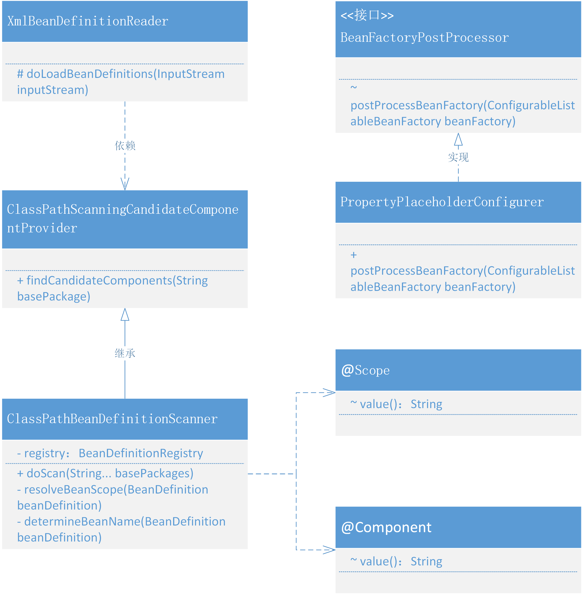

# 通过注解配置和包自动扫描的方式完成Bean对象的注册
## 整体设计
结合bean的生命周期，包扫描只不过是扫描特定注解的类，提取类的相关信息组装成BeanDefinition注册到容器中。

在XmlBeanDefinitionReader中解析<context:component-scan />标签，扫描类组装BeanDefinition然后注册到容器中的操作在ClassPathBeanDefinitionScanner#doScan中实现。
- 自动扫描注册主要是扫描添加了自定义注解的类，在xml加载过程中提取类的信息，组装 BeanDefinition 注册到 Spring 容器中。
- 所以我们会用到 <context:component-scan /> 配置包路径并在 XmlBeanDefinitionReader 解析并做相应的处理。这里的处理会包括对类的扫描、获取注解信息等
- 最后还包括了一部分关于 BeanFactoryPostProcessor 的使用，因为我们需要完成对占位符配置信息的加载，所以需要使用到 BeanFactoryPostProcessor 在所有的 BeanDefinition 加载完成后，实例化 Bean 对象之前，修改 BeanDefinition 的属性信息。这一部分的实现也为后续处理关于占位符配置到注解上做准备
## 类关系图
在Bean的生命周期中自动加载包扫描注册Bean对象和设置占位符属性的类关系

- 整个类的关系结构来看，其实涉及的内容并不多，主要包括的就是 xml 解析类 XmlBeanDefinitionReader 对 ClassPathBeanDefinitionScanner#doScan 的使用。
- 在 doScan 方法中处理所有指定路径下添加了注解的类，拆解出类的信息：名称、作用范围等，进行创建 BeanDefinition 好用于 Bean 对象的注册操作。
- PropertyPlaceholderConfigurer 目前看上去像一块单独的内容，后续会把这块的内容与自动加载 Bean 对象进行整合，也就是可以在注解上使用占位符配置一些在配置文件里的属性信息。
## 代码实现
### pom 更新
```xml
<dependencies>
    <!-- https://mvnrepository.com/artifact/org.dom4j/dom4j -->
    <dependency>
        <groupId>org.dom4j</groupId>
        <artifactId>dom4j</artifactId>
        <version>2.1.3</version>
    </dependency>
</dependencies>
```
### 处理占位符配置
```java
public class PropertyPlaceholderConfigurer implements BeanFactoryPostProcessor {

    /**
     * Default placeholder prefix: {@value}
     */
    public static final String DEFAULT_PLACEHOLDER_PREFIX = "${";

    /**
     * Default placeholder suffix: {@value}
     */
    public static final String DEFAULT_PLACEHOLDER_SUFFIX = "}";

    private String location;

    @Override
    public void postProcessBeanFactory(ConfigurableListableBeanFactory beanFactory) throws BeansException {
        // 加载属性文件
        try {
            DefaultResourceLoader resourceLoader = new DefaultResourceLoader();
            Resource resource = resourceLoader.getResource(location);
            Properties properties = new Properties();
            properties.load(resource.getInputStream());

            String[] beanDefinitionNames = beanFactory.getBeanDefinitionNames();
            for (String beanName : beanDefinitionNames) {
                BeanDefinition beanDefinition = beanFactory.getBeanDefinition(beanName);

                PropertyValues propertyValues = beanDefinition.getPropertyValues();
                for (PropertyValue propertyValue : propertyValues.getPropertyValues()) {
                    Object value = propertyValue.getValue();
                    if (!(value instanceof String)) continue;
                    String strVal = (String) value;
                    StringBuilder buffer = new StringBuilder(strVal);
                    int startIdx = strVal.indexOf(DEFAULT_PLACEHOLDER_PREFIX);
                    int stopIdx = strVal.indexOf(DEFAULT_PLACEHOLDER_SUFFIX);
                    if (startIdx != -1 && stopIdx != -1 && startIdx < stopIdx) {
                        String propKey = strVal.substring(startIdx + 2, stopIdx);
                        String propVal = properties.getProperty(propKey);
                        buffer.replace(startIdx, stopIdx + 1, propVal);
                        propertyValues.addPropertyValue(new PropertyValue(propertyValue.getName(), buffer.toString()));
                    }
                }
            }
        } catch (IOException e) {
            throw new BeansException("Could not load properties", e);
        }
    }

    public void setLocation(String location) {
        this.location = location;
    }

}
```

### 定义拦截注解
```java
@Target({ElementType.TYPE, ElementType.METHOD})
@Retention(RetentionPolicy.RUNTIME)
@Documented
public @interface Scope {

    String value() default "singleton";
}
```
```java
@Target(ElementType.TYPE)
@Retention(RetentionPolicy.RUNTIME)
@Documented
public @interface Component {
    
    String value() default "";
}
```
- Component 自定义注解大家都非常熟悉了，用于配置到 Class 类上的。除此之外还有 Service、Controller，不过所有的处理方式基本一致，这里就只展示一个 Component 即可。

### 处理对象扫描装配
```java
public class ClassPathScanningCandidateComponentProvider {

    public Set<BeanDefinition> findCandidateComponents(String basePackage) {
        Set<BeanDefinition> candidates = new LinkedHashSet<>();
        Set<Class<?>> classes = ClassUtil.scanPackageByAnnotation(basePackage, Component.class);
        for (Class<?> clazz : classes) {
            candidates.add(new BeanDefinition(clazz));
        }
        return candidates;
    }

}
```
- 这里先要提供一个可以通过配置路径 basePackage=com.lile.springframework.test.bean，解析出 classes 信息的工具方法 findCandidateComponents，通过这个方法就可以扫描到所有 @Component 注解的 Bean 对象了。
```java
public class ClassPathBeanDefinitionScanner extends ClassPathScanningCandidateComponentProvider {

    private BeanDefinitionRegistry registry;

    public ClassPathBeanDefinitionScanner(BeanDefinitionRegistry registry) {
        this.registry = registry;
    }

    public void doScan(String... basePackages) {
        for (String basePackage : basePackages) {
            Set<BeanDefinition> candidates = findCandidateComponents(basePackage);
            for (BeanDefinition beanDefinition : candidates) {
                // 解析 Bean 的作用域 singleton、prototype
                String beanScope = resolveBeanScope(beanDefinition);
                if (StrUtil.isNotEmpty(beanScope)) {
                    beanDefinition.setScope(beanScope);
                }
                registry.registerBeanDefinition(determineBeanName(beanDefinition), beanDefinition);
            }
        }
    }

    private String resolveBeanScope(BeanDefinition beanDefinition) {
        Class<?> beanClass = beanDefinition.getBeanClass();
        Scope scope = beanClass.getAnnotation(Scope.class);
        if (null != scope) return scope.value();
        return StrUtil.EMPTY;
    }

    private String determineBeanName(BeanDefinition beanDefinition) {
        Class<?> beanClass = beanDefinition.getBeanClass();
        Component component = beanClass.getAnnotation(Component.class);
        String value = component.value();
        if (StrUtil.isEmpty(value)) {
            value = StrUtil.lowerFirst(beanClass.getSimpleName());
        }
        return value;
    }

}
```
- ClassPathBeanDefinitionScanner 是继承自 ClassPathScanningCandidateComponentProvider 的具体扫描包处理的类，在 doScan 中除了获取到扫描的类信息以后，还需要获取 Bean 的作用域和类名，如果不配置类名基本都是把首字母缩写。
### 解析xml中调用扫描
```java
public class XmlBeanDefinitionReader extends AbstractBeanDefinitionReader {

    public XmlBeanDefinitionReader(BeanDefinitionRegistry registry) {
        super(registry);
    }

    public XmlBeanDefinitionReader(BeanDefinitionRegistry registry, ResourceLoader resourceLoader) {
        super(registry, resourceLoader);
    }

    @Override
    public void loadBeanDefinitions(Resource resource) throws BeansException {
        try {
            try (InputStream inputStream = resource.getInputStream()) {
                doLoadBeanDefinitions(inputStream);
            }
        } catch (IOException | ClassNotFoundException | DocumentException e) {
            throw new BeansException("IOException parsing XML document from " + resource, e);
        }
    }

    @Override
    public void loadBeanDefinitions(Resource... resources) throws BeansException {
        for (Resource resource : resources) {
            loadBeanDefinitions(resource);
        }
    }

    @Override
    public void loadBeanDefinitions(String location) throws BeansException {
        ResourceLoader resourceLoader = getResourceLoader();
        Resource resource = resourceLoader.getResource(location);
        loadBeanDefinitions(resource);
    }

    @Override
    public void loadBeanDefinitions(String... locations) throws BeansException {
        for (String location : locations) {
            loadBeanDefinitions(location);
        }
    }

    protected void doLoadBeanDefinitions(InputStream inputStream) throws ClassNotFoundException, DocumentException {
        SAXReader reader = new SAXReader();
        Document document = reader.read(inputStream);
        Element root = document.getRootElement();

        // 解析 context:component-scan 标签，扫描包中的类并提取相关信息，用于组装 BeanDefinition
        Element componentScan = root.element("component-scan");
        if (null != componentScan) {
            String scanPath = componentScan.attributeValue("base-package");
            if (StrUtil.isEmpty(scanPath)) {
                throw new BeansException("The value of base-package attribute can not be empty or null");
            }
            scanPackage(scanPath);
        }

        List<Element> beanList = root.elements("bean");
        for (Element bean : beanList) {

            String id = bean.attributeValue("id");
            String name = bean.attributeValue("name");
            String className = bean.attributeValue("class");
            String initMethod = bean.attributeValue("init-method");
            String destroyMethodName = bean.attributeValue("destroy-method");
            String beanScope = bean.attributeValue("scope");

            // 获取 Class，方便获取类中的名称
            Class<?> clazz = Class.forName(className);
            // 优先级 id > name
            String beanName = StrUtil.isNotEmpty(id) ? id : name;
            if (StrUtil.isEmpty(beanName)) {
                beanName = StrUtil.lowerFirst(clazz.getSimpleName());
            }

            // 定义Bean
            BeanDefinition beanDefinition = new BeanDefinition(clazz);
            beanDefinition.setInitMethodName(initMethod);
            beanDefinition.setDestroyMethodName(destroyMethodName);

            if (StrUtil.isNotEmpty(beanScope)) {
                beanDefinition.setScope(beanScope);
            }

            List<Element> propertyList = bean.elements("property");
            // 读取属性并填充
            for (Element property : propertyList) {
                // 解析标签：property
                String attrName = property.attributeValue("name");
                String attrValue = property.attributeValue("value");
                String attrRef = property.attributeValue("ref");
                // 获取属性值：引入对象、值对象
                Object value = StrUtil.isNotEmpty(attrRef) ? new BeanReference(attrRef) : attrValue;
                // 创建属性信息
                PropertyValue propertyValue = new PropertyValue(attrName, value);
                beanDefinition.getPropertyValues().addPropertyValue(propertyValue);
            }
            if (getRegistry().containsBeanDefinition(beanName)) {
                throw new BeansException("Duplicate beanName[" + beanName + "] is not allowed");
            }
            // 注册 BeanDefinition
            getRegistry().registerBeanDefinition(beanName, beanDefinition);
        }
    }

    private void scanPackage(String scanPath) {
        String[] basePackages = StrUtil.splitToArray(scanPath, ',');
        ClassPathBeanDefinitionScanner scanner = new ClassPathBeanDefinitionScanner(getRegistry());
        scanner.doScan(basePackages);
    }

}
```
- 关于 XmlBeanDefinitionReader 中主要是在加载配置文件后，处理新增的自定义配置属性 component-scan，解析后调用 scanPackage 方法，其实也就是我们在 ClassPathBeanDefinitionScanner#doScan 功能。
- 另外这里需要注意，为了可以方便的加载和解析xml，XmlBeanDefinitionReader 已经全部替换为 dom4j 的方式进行解析处理。

## 测试代码
### 准备代码
```java
@Component("userService14")
public class UserService14 implements IUserService12 {

    private String token;

    public String queryUserInfo() {
        try {
            Thread.sleep(new Random(1).nextInt(100));
        } catch (InterruptedException e) {
            e.printStackTrace();
        }
        return "李明，66668888，北京";
    }

    public String register(String userName) {
        try {
            Thread.sleep(new Random(1).nextInt(100));
        } catch (InterruptedException e) {
            e.printStackTrace();
        }
        return "注册用户：" + userName + " success！";
    }

    @Override
    public String toString() {
        return "UserService14#token = { " + token + " }";
    }

    public String getToken() {
        return token;
    }

    public void setToken(String token) {
        this.token = token;
    }

}
```
- 给 UserService 类添加一个自定义注解 @Component("userService14") 和一个属性信息 String token。这是为了分别测试包扫描和占位符属性。
### 属性配置
```text
token=Li66668888
```
- 这里配置一个 token 的属性信息，用于通过占位符的方式进行获取

spring14-scan.xml
```xml
<?xml version="1.0" encoding="UTF-8"?>
<beans xmlns="http://www.springframework.org/schema/beans"
       xmlns:xsi="http://www.w3.org/2001/XMLSchema-instance"
       xmlns:context="http://www.springframework.org/schema/context"
       xsi:schemaLocation="http://www.springframework.org/schema/beans
	         http://www.springframework.org/schema/beans/spring-beans.xsd
		 http://www.springframework.org/schema/context">

    <context:component-scan base-package="com.lile.springframework.test.bean"/>

</beans>
```
- 添加 component-scan 属性，设置包扫描根路径

spring14-property.xml
```xml
<?xml version="1.0" encoding="UTF-8"?>
<beans xmlns="http://www.springframework.org/schema/beans"
       xmlns:xsi="http://www.w3.org/2001/XMLSchema-instance"
       xmlns:context="http://www.springframework.org/schema/context"
       xsi:schemaLocation="http://www.springframework.org/schema/beans
	         http://www.springframework.org/schema/beans/spring-beans.xsd
		 http://www.springframework.org/schema/context">
    <bean class="com.lile.springframework.beans.factory.PropertyPlaceholderConfigurer">
        <property name="location" value="classpath:token.properties"/>
    </bean>

    <bean id="userService14" class="com.lile.springframework.test.bean.UserService14">
        <property name="token" value="${token}"/>
    </bean>

</beans>
```
- 加载 classpath:token.properties 设置占位符属性值 ${token}

### 单元测试
```java
public class ApiTest14 {
    @Test
    public void test_scan() {
        ClassPathXmlApplicationContext applicationContext = new ClassPathXmlApplicationContext("classpath:spring14-scan.xml");
        IUserService12 userService = applicationContext.getBean("userService14", IUserService12.class);
        System.out.println("测试结果：" + userService.queryUserInfo());
    }

    @Test
    public void test_property() {
        ClassPathXmlApplicationContext applicationContext = new ClassPathXmlApplicationContext("classpath:spring14-property.xml");
        IUserService12 userService = applicationContext.getBean("userService14", IUserService12.class);
        System.out.println("测试结果：" + userService);
    }

    @Test
    public void test_beanPost(){

        BeanPostProcessor beanPostProcessor = new BeanPostProcessor() {
            @Override
            public Object postProcessBeforeInitialization(Object bean, String beanName) throws BeansException {
                return null;
            }

            @Override
            public Object postProcessAfterInitialization(Object bean, String beanName) throws BeansException {
                return null;
            }
        };

        List<BeanPostProcessor> beanPostProcessors = new ArrayList<>();
        beanPostProcessors.add(beanPostProcessor);
        beanPostProcessors.add(beanPostProcessor);
        beanPostProcessors.remove(beanPostProcessor);

        System.out.println(beanPostProcessors.size());
    }
}
```