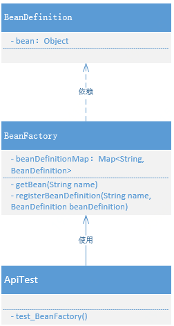

# mini-spring-ioc
这是一个简单的IOC容器，用于学习IOC的原理
## 1. 创建简单的Bean容器
凡是可以存放数据的具体数据结构实现，都可以称之为容器。例如：ArrayList、LinkedList、HashSet等，但在 Spring Bean 容器的场景下，我们需要一种可以用于存放和名称索引式的数据结构，所以选择 HashMap 是最合适不过的。

一个简单的 Spring Bean 容器实现，需 Bean 的定义、注册、获取三个基本步骤

- 定义：BeanDefinition，可能这是你在查阅 Spring 源码时经常看到的一个类，例如它会包括 singleton、prototype、BeanClassName 等。但目前我们初步实现会更加简单的处理，只定义一个 Object 类型用于存放对象。
- 注册：这个过程就相当于我们把数据存放到 HashMap 中，只不过现在 HashMap 存放的是定义了的 Bean 的对象信息。
- 获取：最后就是获取对象，Bean 的名字就是key，Spring 容器初始化好 Bean 以后，就可以直接获取了。

类关系图：


#### 代码实现
```java
public class BeanDefinition {

    private Object bean;

    public BeanDefinition(Object bean) {
        this.bean = bean;
    }

    public Object getBean() {
        return bean;
    }

}
```
```java
public class BeanFactory {

    private Map<String, BeanDefinition> beanDefinitionMap = new ConcurrentHashMap<>();

    public Object getBean(String name) {
        return beanDefinitionMap.get(name).getBean();
    }

    public void registerBeanDefinition(String name, BeanDefinition beanDefinition) {
        beanDefinitionMap.put(name, beanDefinition);
    }

}
```
#### 测试代码
```java
public class UserService {

    public void queryUserInfo(){
        System.out.println("查询用户信息");
    }

}
```
```java
@Test
public void test_BeanFactory(){
    // 1.初始化 BeanFactory
    BeanFactory beanFactory = new BeanFactory();
    
    // 2.注册 bean
    BeanDefinition beanDefinition = new BeanDefinition(new UserService());
    beanFactory.registerBeanDefinition("userService", beanDefinition);
    
    // 3.获取 bean
    UserService userService = (UserService) beanFactory.getBean("userService");
    userService.queryUserInfo();
}
```

## 2. 实现Bean的定义、注册、获取

## 3. 基于Cglib实现含构造函数的类实例化策略

## 4. 注入属性和依赖对象

## 5. 资源加载器解析文件注册对象

## 6. 实现应用上下文

## 7. 初始化和销毁方法

## 8. Aware感知容器对象

## 9. 对象作用域和FactoryBean

## 10. 容器事件和事件监听